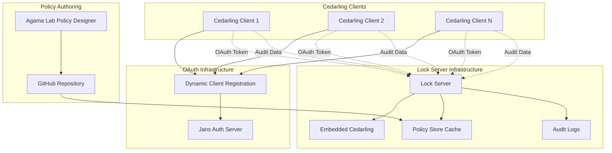

---
tags:
  - administration
  - lock
  - authorization
  - authz
  - Cedar
  - Cedarling
  - policy-retrieval-point
  - java-weld
---

# Lock Server Configuration and Operation

The Janssen Lock Server is a Java Weld application that serves as the centralized Policy Retrieval Point (PRP) in a distributed Cedar-based authorization architecture. It connects ephemeral Cedarling instances to enterprise infrastructure by providing policy distribution, audit log collection, and OAuth-protected endpoints for secure communication.

## Overview

The Lock Server acts as the bridge between policy authoring tools (like Agama Lab Policy Designer) and distributed Cedarling instances, ensuring consistent policy enforcement across the network while maintaining high availability and security.

### Key Capabilities

- **Policy Distribution**: Centralized management and distribution of Cedar policies
- **Policy Updates**: Efficient policy change management and distribution
- **Audit Collection**: Centralized logging of authorization decisions and system events
- **OAuth Security**: Comprehensive OAuth 2.0 protection for all endpoints
- **Flexible Deployment**: Standalone or integrated with Jans Auth Server
- **Management Interfaces**: CLI, TUI, and REST API for administration

## Architecture

### High-Level Components



### Internal Architecture

The Lock Server consists of several layers:

- **Web Layer**: REST endpoints for policy and audit operations
- **Security Layer**: OAuth token validation and Cedarling authorization
- **Business Logic**: Policy store management, audit collection, client management
- **Data Layer**: Policy store cache, audit storage, client registry
- **Integration Layer**: Embedded Cedarling, external policy sources

## Installation and Deployment

### Deployment Options

The Lock Server supports two primary deployment models:

#### Standalone Deployment

Deploy Lock Server as an independent web application:

```yaml
# docker-compose.yml
version: '3.8'
services:
  lock-server:
    image: janssenproject/lock-server:latest
    ports:
      - "8080:8080"
    environment:
      - LOCK_SERVER_POLICY_STORE_SOURCE=github
      - LOCK_SERVER_GITHUB_REPO=org/policy-repo
      - LOCK_SERVER_OAUTH_ISSUER=https://auth.example.com
      - LOCK_SERVER_JWKS_URI=https://auth.example.com/.well-known/jwks
    volumes:
      - ./config:/opt/jans/lock-server/config
      - ./logs:/opt/jans/lock-server/logs
    networks:
      - jans-network

  redis:
    image: redis:alpine
    networks:
      - jans-network

networks:
  jans-network:
    driver: bridge
```

#### Integrated Deployment

Deploy Lock Server embedded within Jans Auth Server:

```yaml
# Jans Auth Server configuration
services:
  jans-auth:
    image: janssenproject/jans-auth-server:latest
    environment:
      - JANS_LOCK_SERVER_ENABLED=true
      - JANS_LOCK_SERVER_POLICY_STORE_SOURCE=local
      - JANS_LOCK_SERVER_EMBEDDED_MODE=true
    volumes:
      - ./lock-server-config:/opt/jans/jetty/jans-auth/custom/lock-server
      - ./policy-stores:/opt/jans/lock-server/policy-stores
```

#### High Availability Setup

For production deployments requiring high availability:

```yaml
# HA deployment with load balancer
services:
  nginx:
    image: nginx:alpine
    ports:
      - "443:443"
    volumes:
      - ./nginx.conf:/etc/nginx/nginx.conf
      - ./ssl:/etc/nginx/ssl
    depends_on:
      - lock-server-1
      - lock-server-2

  lock-server-1:
    image: janssenproject/lock-server:latest
    environment:
      - LOCK_SERVER_INSTANCE_ID=lock-server-1
      - LOCK_SERVER_REDIS_URL=redis://redis:6379
    depends_on:
      - redis

  lock-server-2:
    image: janssenproject/lock-server:latest
    environment:
      - LOCK_SERVER_INSTANCE_ID=lock-server-2
      - LOCK_SERVER_REDIS_URL=redis://redis:6379
    depends_on:
      - redis

  redis:
    image: redis:alpine
    command: redis-server --appendonly yes
    volumes:
      - redis-data:/data

volumes:
  redis-data:
```

### Installation Steps

1. **Prerequisites**
   - Java 11 or higher
   - Jans Auth Server (for OAuth services)
   - Redis (for HA deployments)

2. **Download and Extract**
   ```bash
   wget https://github.com/JanssenProject/jans/releases/latest/download/lock-server.tar.gz
   tar -xzf lock-server.tar.gz
   cd lock-server
   ```

3. **Configure Environment**
   ```bash
   cp config/lock-server.properties.template config/lock-server.properties
   # Edit configuration file with your settings
   ```

4. **Start Lock Server**
   ```bash
   ./bin/start-lock-server.sh
   ```

## Configuration

### Core Configuration Properties

The Lock Server uses a properties file for configuration:

```properties
# Lock Server Configuration
lock.server.host=0.0.0.0
lock.server.port=8080
lock.server.context.path=/

# OAuth Configuration
lock.server.oauth.issuer=https://auth.example.com
lock.server.oauth.jwks.uri=https://auth.example.com/.well-known/jwks
lock.server.oauth.token.validation.enabled=true

# Policy Store Configuration
lock.server.policy.store.source=github
lock.server.policy.store.github.repo=organization/policy-repo
lock.server.policy.store.github.branch=main
lock.server.policy.store.github.token=${GITHUB_TOKEN}
lock.server.policy.store.cache.ttl=300

# Cedarling Configuration
lock.server.cedarling.policy.store.uri=file:///opt/jans/lock-server/policies/lock-server-policies.json
lock.server.cedarling.log.level=INFO

# Audit Configuration
lock.server.audit.enabled=true
lock.server.audit.storage=file
lock.server.audit.file.path=/opt/jans/lock-server/logs/lock_server_audit.log
lock.server.audit.rdbms.enabled=false

# Policy Update Configuration
lock.server.policy.update.enabled=true
lock.server.policy.update.check.interval=60

# Logging Configuration
lock.server.log.level=INFO
lock.server.log.config.file=/opt/jans/lock-server/logs/lock_server_config.log
lock.server.log.jwt.status.file=/opt/jans/lock-server/logs/lock_server_jwt_status.log
```

### Policy Store Sources

The Lock Server supports multiple policy store sources:

#### GitHub Repository
```properties
lock.server.policy.store.source=github
lock.server.policy.store.github.repo=organization/policy-repo
lock.server.policy.store.github.branch=main
lock.server.policy.store.github.path=policy-stores/
lock.server.policy.store.github.token=${GITHUB_TOKEN}
```

#### Local File System
```properties
lock.server.policy.store.source=file
lock.server.policy.store.file.path=/opt/jans/lock-server/policy-stores/
lock.server.policy.store.file.watch.enabled=true
```

#### HTTP Endpoint
```properties
lock.server.policy.store.source=http
lock.server.policy.store.http.base.url=https://policy-server.example.com/api/v1/
lock.server.policy.store.http.auth.type=bearer
lock.server.policy.store.http.auth.token=${POLICY_SERVER_TOKEN}
```


## REST API Endpoints

The Lock Server provides several REST API endpoints for different operations:

### Policy Store Endpoints

#### Get Policy Store
```http
GET /policy-store/{id}
Authorization: Bearer <access_token>
```

**Response:**
```json
{
  "cedar_version": "v4.0.0",
  "policy_store": {
    "name": "Application Policy Store",
    "description": "Policies for application authorization",
    "policies": { ... },
    "schema": { ... },
    "trusted_issuers": { ... }
  }
}
```

#### List Policy Stores
```http
GET /policy-stores
Authorization: Bearer <access_token>
```

**Response:**
```json
{
  "policy_stores": [
    {
      "id": "app-policies",
      "name": "Application Policies",
      "description": "Main application policy store",
      "version": "1.2.3",
      "last_updated": "2024-01-01T12:00:00Z"
    }
  ]
}
```

### Audit Endpoints

#### Submit Audit Logs
```http
POST /audit/logs
Authorization: Bearer <access_token>
Content-Type: application/json

{
  "logs": [
    {
      "request_id": "req-123456",
      "timestamp": "2024-01-01T12:00:00Z",
      "log_kind": "Decision",
      "pdp_id": "cedarling-001",
      "policy_store_id": "app-policies",
      "decision": "ALLOW",
      "principal": "Jans::User::\"user123\"",
      "action": "Jans::Action::\"read\"",
      "resource": "Jans::Application::\"app001\"",
      "diagnostics": {
        "reason": ["policy-001"],
        "errors": []
      },
      "decision_time_ms": 15
    }
  ]
}
```

#### Submit Health Status
```http
POST /audit/health
Authorization: Bearer <access_token>
Content-Type: application/json

{
  "pdp_id": "cedarling-001",
  "timestamp": "2024-01-01T12:00:00Z",
  "status": "healthy",
  "policy_store_version": "1.2.3",
  "uptime_seconds": 86400,
  "memory_usage_mb": 128,
  "cpu_usage_percent": 15.5
}
```

#### Submit Telemetry Data
```http
POST /audit/telemetry
Authorization: Bearer <access_token>
Content-Type: application/json

{
  "pdp_id": "cedarling-001",
  "timestamp": "2024-01-01T12:00:00Z",
  "metrics": {
    "total_requests": 1000,
    "successful_requests": 950,
    "failed_requests": 50,
    "average_response_time_ms": 12.5,
    "policy_evaluations": 1000,
    "cache_hits": 800,
    "cache_misses": 200
  }
}
```


### Well-Known Configuration

#### Lock Server Configuration
```http
GET /.well-known/lock-master-configuration
```

**Response:**
```json
{
  "issuer": "https://lock-server.example.com",
  "policy_store_endpoint": "https://lock-server.example.com/policy-store",
  "policy_stores_endpoint": "https://lock-server.example.com/policy-stores",
  "audit_endpoint": "https://lock-server.example.com/audit",

  "jwks_uri": "https://auth.example.com/.well-known/jwks",
  "scopes_supported": [
    "https://jans.io/oauth/lock/policy-store.read",
    "https://jans.io/oauth/lock/log.write",
    "https://jans.io/oauth/lock/health.write",
    "https://jans.io/oauth/lock/telemetry.write"
  ],
  "features_supported": [
    "policy-store-retrieval",
    "audit-collection",
    "health-monitoring",
    "telemetry-collection"
  ]
}
```

## OAuth Security

### Scope-Based Access Control

The Lock Server uses OAuth 2.0 scopes to control access to different endpoints:

| Scope | Endpoints | Description |
|-------|-----------|-------------|
| `https://jans.io/oauth/lock/policy-store.read` | `/policy-store/*`, `/policy-stores` | Read access to policy stores |
| `https://jans.io/oauth/lock/log.write` | `/audit/logs` | Submit authorization decision logs |
| `https://jans.io/oauth/lock/health.write` | `/audit/health` | Submit health status information |
| `https://jans.io/oauth/lock/telemetry.write` | `/audit/telemetry` | Submit telemetry and metrics data |

## Logging and Monitoring

### Log Files

The Lock Server generates several log files for different purposes:

#### Configuration Log (`lock_server_config.log`)
Records configuration changes and system events:
```
2024-01-01 12:00:00 INFO  [ConfigService] Policy store configuration updated: app-policies
2024-01-01 12:01:00 INFO  [ConfigService] Trusted issuer added: enterprise_idp
2024-01-01 12:02:00 WARN  [ConfigService] Policy store cache miss for: test-policies
2024-01-01 12:03:00 ERROR [ConfigService] Failed to fetch policy store from GitHub: network timeout
```

#### Audit Log (`lock_server_audit.log`)
Stores authorization decisions and audit events:
```json
{
  "timestamp": "2024-01-01T12:00:00Z",
  "request_id": "req-123456",
  "log_kind": "Decision",
  "pdp_id": "cedarling-001",
  "policy_store_id": "app-policies",
  "decision": "ALLOW",
  "principal": "Jans::User::\"user123\"",
  "action": "Jans::Action::\"read\"",
  "resource": "Jans::Application::\"app001\"",
  "decision_time_ms": 15
}
```

#### JWT Status Log (`lock_server_jwt_status.log`)
Tracks JWT token validation and processing:
```
2024-01-01 12:00:00 INFO  [JWTValidator] Token validated successfully for client: client123
2024-01-01 12:01:00 WARN  [JWTValidator] Token expired for client: client456
2024-01-01 12:02:00 ERROR [JWTValidator] Invalid signature for token from issuer: https://malicious.com
```

### RDBMS Audit Storage

For enterprise deployments, audit logs can be stored in a relational database:

```sql
CREATE TABLE audit_logs (
    id VARCHAR(255) PRIMARY KEY,
    client_id VARCHAR(255),
    request_id VARCHAR(255),
    timestamp TIMESTAMP,
    log_kind VARCHAR(50),
    pdp_id VARCHAR(255),
    policy_store_id VARCHAR(255),
    decision VARCHAR(10),
    principal TEXT,
    action TEXT,
    resource TEXT,
    diagnostics JSON,
    decision_time_ms BIGINT,
    INDEX idx_timestamp (timestamp),
    INDEX idx_client_id (client_id),
    INDEX idx_policy_store_id (policy_store_id)
);
```

### Metrics and Monitoring

The Lock Server exposes metrics for monitoring:

- **Policy Store Metrics**: Cache hit/miss rates, fetch times, update frequencies
- **Authorization Metrics**: Request rates, decision times, success/failure ratios
- **Client Metrics**: Active connections, request patterns, error rates
- **System Metrics**: Memory usage, CPU utilization, response times

## CLI Management

### Jans CLI Commands

The Lock Server can be managed using Jans CLI commands:

#### Policy Store Management
```bash
# List policy stores
jans-cli --operation-id get-lock-policy-stores

# Get specific policy store
jans-cli --operation-id get-lock-policy-store --url-suffix "app-policies"

# Update policy store configuration
jans-cli --operation-id put-lock-policy-store --url-suffix "app-policies" \
  --data '{"source": "github", "repository": "org/new-repo"}'

# Delete policy store
jans-cli --operation-id delete-lock-policy-store --url-suffix "app-policies"
```

#### Client Management
```bash
# List connected Cedarling clients
jans-cli --operation-id get-lock-clients

# Get client details
jans-cli --operation-id get-lock-client --url-suffix "client123"

# Search clients by username
jans-cli --operation-id get-lock-clients --query "username=john.doe"

# View client authorization activity
jans-cli --operation-id get-lock-client-activity --url-suffix "client123" \
  --query "start_date=2024-01-01&end_date=2024-01-31"
```

#### Metrics and Monitoring
```bash
# Get authorization metrics
jans-cli --operation-id get-lock-metrics --query "metric=authorization_requests&period=daily"

# Get system health
jans-cli --operation-id get-lock-health

# Get audit log summary
jans-cli --operation-id get-lock-audit-summary --query "start_date=2024-01-01"
```

### TUI Interface

The Text-based User Interface provides an interactive way to manage Lock Server:

1. **Access TUI**: `sudo /opt/jans/bin/jans-tui.py`
2. **Navigate to Lock Server**: `Lock Server` > `Configuration`
3. **Available Sections**:
   - Policy Store Management
   - Client Registry
   - Audit Logs
   - System Metrics
   - Configuration Settings

## Troubleshooting

### Common Issues

#### Policy Store Not Loading
**Symptoms**: Cedarling clients cannot retrieve policy stores
**Causes**: 
- Invalid policy store source configuration
- Network connectivity issues
- Authentication failures with external sources

**Solutions**:
```bash
# Check policy store configuration
jans-cli --operation-id get-lock-policy-store-config

# Test policy store connectivity
curl -H "Authorization: Bearer <token>" \
  https://lock-server.example.com/policy-store/app-policies

# Check logs for errors
tail -f /opt/jans/lock-server/logs/lock_server_config.log
```

#### OAuth Token Validation Failures
**Symptoms**: Clients receive 401 Unauthorized responses
**Causes**:
- Expired or invalid access tokens
- Incorrect JWKS URI configuration
- Clock synchronization issues

**Solutions**:
```bash
# Verify JWKS URI configuration
jans-cli --operation-id get-lock-oauth-config

# Check JWT status logs
tail -f /opt/jans/lock-server/logs/lock_server_jwt_status.log

# Test token validation manually
curl -H "Authorization: Bearer <token>" \
  https://lock-server.example.com/.well-known/lock-master-configuration
```

#### Policy Update Issues
**Symptoms**: Cedarling clients not receiving latest policy updates
**Causes**:
- Policy store cache configuration issues
- Network connectivity problems
- Policy source synchronization failures

**Solutions**:
```bash
# Check policy store cache status
jans-cli --operation-id get-lock-policy-cache-status

# Force policy store refresh
jans-cli --operation-id post-lock-policy-refresh --url-suffix "app-policies"

# Monitor policy update logs
tail -f /opt/jans/lock-server/logs/lock_server_config.log
```

### Performance Optimization

#### Policy Store Caching
- Increase cache TTL for stable policy stores
- Use Redis for distributed caching in HA setups
- Monitor cache hit rates and adjust accordingly

#### Database Optimization
- Create appropriate indexes for audit log queries
- Implement log rotation and archival policies
- Use connection pooling for database access

#### Network Optimization
- Use CDN for policy store distribution
- Implement compression for large policy stores
- Configure appropriate timeout values

## Security Considerations

### Production Deployment Security

1. **TLS Configuration**: Always use HTTPS in production
2. **Token Security**: Implement proper token rotation and validation
3. **Network Security**: Use firewalls and network segmentation
4. **Audit Security**: Protect audit logs from tampering
5. **Access Control**: Implement least-privilege access principles

### Security Best Practices

- Regular security updates and patches
- Monitoring and alerting for security events
- Regular audit log reviews
- Secure backup and recovery procedures
- Incident response planning

## API Reference

For complete API documentation, see the [Lock Server OpenAPI Specification](https://gluu.org/swagger-ui/?url=https://raw.githubusercontent.com/JanssenProject/jans/refs/heads/main/jans-lock/lock-server.yaml).

## See Also

- **[Janssen Lock Overview](./README.md)**: Complete Lock ecosystem documentation
- **[Cedarling Documentation](../../cedarling/README.md)**: Client-side authorization engine
- **[Cedar Policy Language](https://docs.cedarpolicy.com/)**: Official Cedar documentation
- **[OAuth 2.0 Configuration](../auth-server/oauth-features/README.md)**: OAuth implementation details
- **[Jans CLI Reference](../config-guide/config-tools/jans-cli/README.md)**: Command-line interface documentation