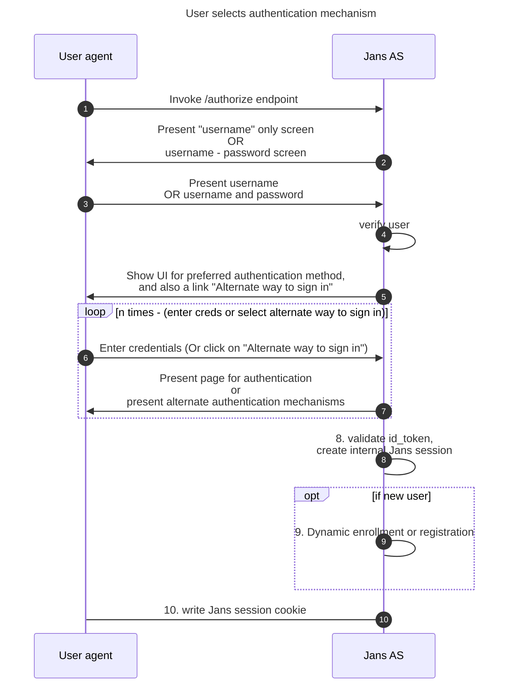

# User Journey

Janssen's authentication server can integrate with any number of authentication mechanisms from different vendors. Factoring the pros and cons of each method, organizations can offer a diverse set of options. A users can register multiple types of credentials and use any preferred credential to perform a login.

An ACRouter Script is a `PersonAuthenticationType` script orchestrates a 2FA flow by delegating specific implementation details of authentication methods to other scripts. This allows the flow to present users with alternatives in case some credential is not working as expected or is lost.


### Authentication flow


### **An ACRouter script**: 
Currently, the Jans Auth server comes with 2 `PersonAuthenticationType` interception scripts that integrate multiple authentication methods and offer alternative options to users for sign-in. 

1. [Casa Script](https://github.com/GluuFederation/flex/blob/main/casa/extras/README.md)
The `casa` script offers a 2 steps authentication flow with login and password prompted in the first step and a user-preferred authentication mechanism in the second step.

2. [Passwordless script]()
The `passwordless` script offers a 2 steps authentication flow with username prompted in the first step and a user-preferred authentication mechanism in the second step.

### Casa App for enrollment of a variety of credentials:
**Casa** is a self-service web portal for end-users can be used to 
1. Enroll, delete and manage two-factor authentication (2FA) credentials for their account (e.g. FIDO security keys, mobile apps, phone numbers, etc.)
1. Turn 2FA on and off

### Adding a new authentication method as an "alternative authentication method":

#### Step 1: Write a custom script:
Ensure the following preconditions are met so that the authentication mehtod integrates seamlessly within flow:
1. The orchestrator script looks for authentication method scripts under `/opt/jans/python/libs`.  Write a custom script that focuses only on authentication. The script file name should follow naming convention like `orchestratorName-external_acrName` e.g. `casa-external_fido2` or `pwdless-external_fido2`
1. For step 1, `prepareForStep` must only return `True`  
1. For step 1, `getExtraParametersForStep` must only return `None`  
1. For step 1, the `authenticate` routine must check if there is already an authenticated user, and if so bypass validating the username and password. This is because a user may have previously attempted authentication with a different method.
1. Keep in mind that `getPageForStep` won't be called when `step=1` in your script. The orchestrator script i.e. `casa` or `passwordless` script takes charge of this specific step/method combination  
1. Add a `hasEnrollments` routine with a signature like this
  `def hasEnrollments(self, configurationAttributes, user):`  
 `hasEnrollments` must return `True` or `False`, describing whether `user` has one or more credentials enrolled for the type you are interested in  
**Objects:**

| Object name | Object description |
|:-----|:------|
|`customScript`| The custom script object. [Reference](https://github.com/JanssenProject/jans/blob/main/jans-core/script/src/main/java/io/jans/model/custom/script/model/CustomScript.java) |
|`configurationAttributes`| `configurationProperties` passed in when adding custom script. `Map<String, SimpleCustomProperty> configurationAttributes` |
|`SimpleCustomProperty`| Map of configuration properties. [Reference](https://github.com/JanssenProject/jans/blob/main/jans-core/util/src/main/java/io/jans/model/SimpleCustomProperty.java) |
|`User`|User object [Reference](https://github.com/JanssenProject/jans/blob/main/jans-auth-server/common/src/main/java/io/jans/as/common/model/common/User.java)|
 

#### Step2: Modification to web-pages:
1. Ensure that custom pages returned by `getPageForStep` for step 2 (or higher) contain the fragment:
```
    <ui:include src="/casa/casa.xhtml" />
```
This will display a set of links for the user to navigate to alternate 2FA pages. The list will be shown when clicking on a link which should be provided this way:
```
    <a href="javascript:showAlternative('ELEMENT_ID')" id="alter_link" class="green hover-green f7-cust">#{msgs['casa.alternative']}</a>
```
Here `ELEMENT_ID` is the identifier for the HTML node that wraps all visual elements of your page (excluding `casa.xhtml`). It is required to preserve `alter_link` as `id` for the `a` tag.
1. Place the modified xhtml page under the path specified in `getPageForStep`, for e.g. `/opt/jans/jetty/jans-auth/custom/pages/casa/fido2.xhtml`

#### Step3: Handle enrollment using the Casa app

#### Step 4: Enable the ACRouter script i.e. `passwordless` or `casa` script
Once your script is enabled in the Jans-auth server, you can test it for authentication purposes. Try your script by creating an authentication request passing `casa` or `passwordless` as acr value.


