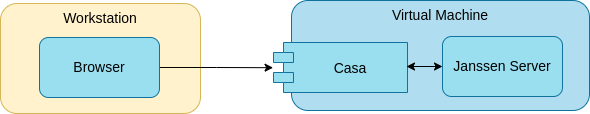

---
tags:
  - administration
  - recipe 
  - casa
---

# Casa - Self-service MFA portal


**Casa** is a self-service web portal that allows end users to view, enroll, and remove MFA credentials, including hardware tokens, software tokens, commercial services (like Duo), social login, biometric, and mobile.  Casa is also extensible. As new authentication technologies arise, you can download plugins to leverage them in your organization through Casa.



## Prerequisites

- Installed Janssen Server  

## Installing Casa

Casa gets installed as an add-on to Janssen Server and integrates with `jans-auth-server` module as an OpenID connect Relying Party.
Casa can be installed using the command below.  

Currently, Casa installation is supported on CentOS 8 and Ubuntu 20.

The following steps will install Casa as an add-on.

- Download installer
  
  ```shell
    wget https://raw.githubusercontent.com/GluuFederation/flex/main/flex-linux-setup/flex_linux_setup/flex_setup.py  -O flex_setup.py
  ```
  
- Run the installer

```shell
python3 flex_setup.py
```
  
### Automate install

If you have `setup.properties` file and want to automate installation, you can pass properties file as

```shell
python3 flex_setup.py -f /path/to/setup.properties -n -c
```

Minimal example setup.properties file:

```shell
ip=10.146.197.201
hostname=flex.gluu.org
orgName=Gluu
admin_email=flex@gluu.org
city=Austin
state=Texas
countryCode=US
installLdap=True
admin_password=MyAdminPassword
ldapPass=MyLdapPassword
casa_client_id=3000.7986c837-2a8f-4c31-9c63-1bd2f6abce77
casa_client_pw=MyCasaClientSecret
```

- You will be prompted:  
`Install Admin UI [Y/n]:`. Select `n`

- You will be prompted:  
`Install Casa [Y/n]:`. Select `y`

- At the end of the installation you will be presented with a URL to access the Casa portal.

- You can use this URL and log into the portal using the administrator credentials that you created during the Janssen Server installation.

## Enabling Authentication methods

1. [Enable authentication mechanisms](../../script-catalog/person_authentication/person-authentication.md#enabling-an-authentication-mechanism) in Jan-auth server like `otp`, `fido2`, `email_otp`.
2. launch jans-cli-tui to enable scripts in Jans-auth server
3. search for script, open script and navigate to enable section and press 
   enter at enable then press save.


4. Login to the Casa portal as an administrator

5. Enable authentication methods by navigating to `Administration console` 
   -> `Enabled Authentication methods`. Details about enabling authentication methods are available in [Casa documentation](https://gluu.org/docs/casa/4.4/administration/admin-console/#configure-casa)

## Configuring authentication methods

At this point, users ([How to create users](../../janssen-server/config-guide/scim-config/user-config.md#creating-a-new-user) can log in to the Casa portal and [enable/configure one or more authentication methods](https://gluu.org/docs/casa/4.4/user-guide/) for their account.

## Uninstalling Casa from Janssen Server

Execute following command to uninstall Casa from Janssen Server

```shell
python3 flex_setup.py -remove casa
```
