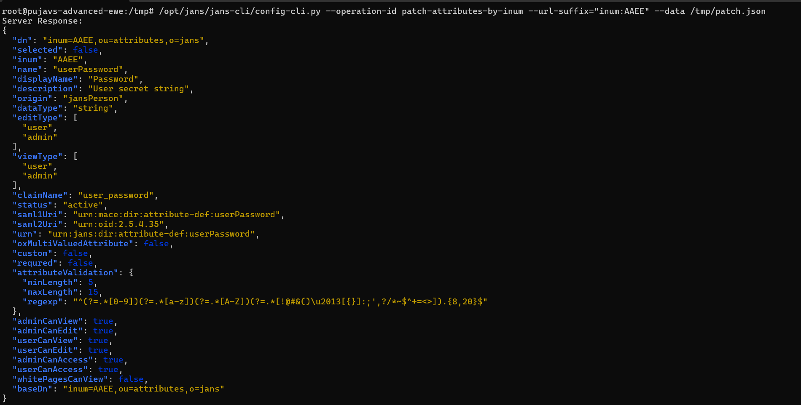
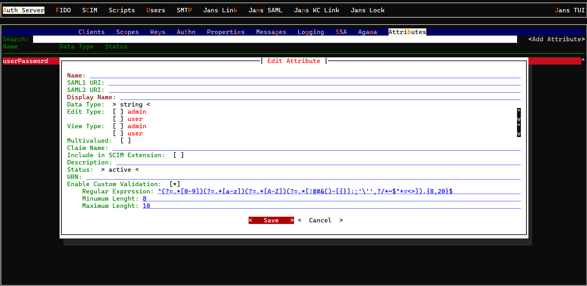

---
tags:
  - administration
  - recipes
  - password
---

# Password validation
User password validation can be set to check the password strength,
like the password must have at least one uppercase, or lowercase, number, and
the length of the password.
By default, the password attribute validation is not enabled.


## Enable user password validation through Command Line Tool (CLI)
1. Obtain the unique ID, that is inum for `userPassword` attribute.
```shell
jans cli --operation-id get-attributes --endpoint-args pattern:userPassword
```

2. Obatin the PatchRequest schema
```shell
jans cli --schema PatchRequest > /tmp/patch.json
```

3. Update `/tmp/patch.json` with user password validation details

    - Enter a valid regex expression to check the strength of the password.
    - Enter **Minimum length**, the minimum length of a value associated with 
      this attribute.
    - Enter **Maximum length**, the maximum length of a value associated with 
      this attribute.
    Following is the example of having `userPassword` with minimum 8 characters,
    maximum 20 characters and should be alphanumeric with special characters.
    ```shell
    [{
        "op": "add",
        "path": "/attributeValidation",
        "value": {
            "minLength": 5,
            "maxLength":15,
            "regexp": "^(?=.*[0-9])(?=.*[a-z])(?=.*[A-Z])(?=.*[!@#&()–[{}]:;',?/*~$^+=<>]).{8,20}$"
        }
    }]
    ```

4. Execute patch operation for `userPassword` attribute.
```shell
jans cli --operation-id patch-attributes-by-inum \
--url-suffix="inum:AAEE" --data /tmp/patch.json
```


5. Create a new user using `post-user` operation.

6. An error notification will be displayed if the password does not match the 
   validation criteria.


## Enable user password validation through Jans Text UI (TUI)

1. When using [Janssen Text-based UI(TUI)](../../janssen-server/config-guide/config-tools/jans-tui/README.md) to configure `userPassword` attribute validation , navigate via
`Auth Server`->`Attributes`->search for `userPassword` attribute->open the attribute details->enable `Enable Custom Validation` field-> Enter a value for `Regular expression`, `Minimum Length` & `Maximum Length` fields->Save


2. Create a new user using `Users` TUI menu.

3. An error notification will be displayed if the password does not match the validation criteria.


## Enable user password validation through Jans Config API

1. Obtain the access token
```shell
curl -k -u "<put_client_id_here>:<put_config_api_client_secret_here>" https://<your.jans.server>/jans-auth/restv1/token \
     -d  "grant_type=client_credentials&scope=https://jans.io/oauth/config/attributes.write"
```

2. Obtain the unique ID, that is inum for `userPassword` attribute.
```shell
curl -k -i -H "Accept: application/json" -H "Content-Type: application/json" \
  -H "Authorization:Bearer <put_access_token_here>" 
  -X GET https://<your.jans.server>/jans-config-api/api/v1/attributes?pattern=userPassword
```

3. Apply Patch for `userPassword`, use inum as path parameter
- Enter a valid regex expression to check the strength of the password.
- Enter **Minimum length**, the minimum length of a value associated with this attribute.
- Enter **Maximum length**, the maximum length of a value associated with this attribute.
  Following is the example of having `userPassword` with minimum 8 characters, maximum 20 characters, and should be alphanumeric with special characters.
```shell
curl -k --location --request PATCH 'https://<your.jans.server>/jans-config-api/api/v1/attributes/<put_userPassword_inum_here>' \
 --header 'Content-Type: application/json-patch+json' --header 'Authorization: Bearer <put_access_token_here>' \
  --data-raw '[{
    "op": "add",
    "path": "/attributeValidation",
    "value": {
        "minLength": 8,
        "maxLength":20,
        "regexp": "^(?=.*[0-9])(?=.*[a-z])(?=.*[A-Z])(?=.*[!@#&()–[{}]:;'\'',?/*~$^+=<>]).{8,20}$"
    }
}]'
```

4. Create a new user using `/jans-config-api/mgt/configuser` endpoint.

5. An error notification will be displayed if the password does not match the validation criteria.