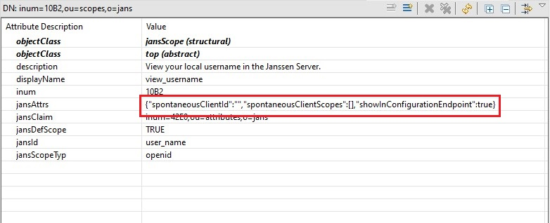

---
tags:
  - administration
  - reference
  - database
---

# LDAP ORM persistence layer

During installation the administrator can select option to install LDAP DB on same server.

For this DB installation generates default **/etc/jans/conf/jans-ldap.properties** and creates **jansdb** schema with tables and  initial data set.


## Configuration properties

List of specific for LDAP default setting from `jans-ldap.properties`:

```
bindDN: cn=directory manager
bindPassword: CC0NHhtXW78=
servers: localhost:1636

useSSL: true
ssl.trustStoreFile: /etc/certs/opendj.pkcs12
ssl.trustStorePin: CC0NHhtXW78=
ssl.trustStoreFormat: pkcs12

maxconnections: 40

# Max wait 20 seconds
connection.max-wait-time-millis=20000

# Force to recreate polled connections after 30 minutes
connection.max-age-time-millis=1800000

# Invoke connection health check after checkout it from pool
connection-pool.health-check.on-checkout.enabled=false

# Interval to check connections in pool. Value is 3 minutes. Not used when onnection-pool.health-check.on-checkout.enabled=true
connection-pool.health-check.interval-millis=180000

# How long to wait during connection health check. Max wait 20 seconds
connection-pool.health-check.max-response-time-millis=20000
```

The rest of properties are static for all other supported DB:

```
binaryAttributes=objectGUID
certificateAttributes=userCertificate
```

## Generic entry type

Each entry type in **o=jans** LDAP schema follow next rules:

1. has base **top** and one **objectClass** which defines attributes
1. entry can have more additional custom attributes. It's possible to add them with additional **objectClass**


## Data mapping rules

ORM supports all LDAP types and convert them to java types at runtime. It also supports multi-valued LDAP attribute values.


For user password field LDAP DB automatically create hash. The type of this hash is specified in server configuration.

To store attributes defined in java beans with `@JsonObject` annotation ORM uses **Directory String** attribute.



# Java example

This example shows how to use ORM. It opens connection to LDAP DB and add user entry to it:

```
    public static void main(String[] args) {
        // Create Sql entry manager
        LdapEntryManager ldapEntryManager = createLdapEntryManager();

        // Create and fill user bean
        SimpleUser newUser = new SimpleUser();
        newUser.setDn(String.format("inum=%s,ou=people,o=jans", System.currentTimeMillis()));
        newUser.setUserId("sample_user_" + System.currentTimeMillis());
        newUser.setUserPassword("test");
        newUser.getCustomAttributes().add(new CustomObjectAttribute("jansAddres", Arrays.asList("London", "Texas", "New York")));
        newUser.getCustomAttributes().add(new CustomObjectAttribute("jansGuid", "test_value"));
        
        // Call ORM API to store entry
        ldapEntryManager.persist(newUser);
        
        ldapEntryManager.destroy();
    }

    public static LdapEntryManager createLdapEntryManager() {
    	LdapEntryManagerFactory ldapEntryManagerFactory = new LdapEntryManagerFactory();
        Properties connectionProperties = getSampleConnectionProperties();

        LdapEntryManager ldapEntryManager = ldapEntryManagerFactory.createEntryManager(connectionProperties);

        return ldapEntryManager;
    }

    private static Properties getSampleConnectionProperties() {
        Properties connectionProperties = new Properties();


        connectionProperties.put("ldap#bindDN", "cn=directory manager");
        connectionProperties.put("ldap#bindPassword", "secret");
        connectionProperties.put("ldap#servers", "localhost:1636");

        connectionProperties.put("ldap#useSSL", "true");
        connectionProperties.put("ldap#maxconnections", "40");

        // Max wait 20 seconds
        connectionProperties.put("ldap#connection.max-wait-time-millis", "20000");
        
        // Force to recreate polled connections after 30 minutes
        connectionProperties.put("ldap#connection.max-age-time-millis", "1800000");
        
        // Invoke connection health check after checkout it from pool
        connectionProperties.put("ldap#connection-pool.health-check.on-checkout.enabled", "false");
        
        // Interval to check connections in pool. Value is 3 minutes. Not used when onnection-pool.health-check.on-checkout.enabled=true
        connectionProperties.put("ldap#connection-pool.health-check.interval-millis", "180000");
        
        // How long to wait during connection health check. Max wait 20 seconds
        connectionProperties.put("ldap#connection-pool.health-check.max-response-time-millis", "20000");

        return connectionProperties;
    }
```

More LDAP ORM examples is in [this](https://github.com/JanssenProject/jans/tree/main/jans-orm/sql-sample/src/main/java/io/jans/orm/sql) sample module.
