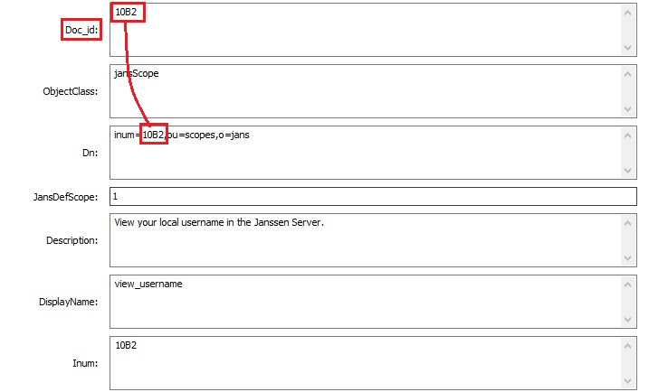
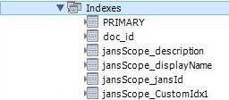
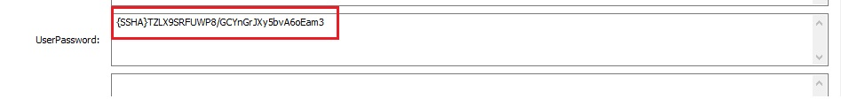
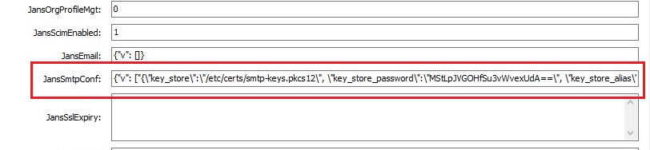

---
tags:
  - administration
  - reference
  - database
  - remote database
---

# MySQL ORM persistence layer

The recommended MySQL version is 8.x or newer. Before running installation the administrator can pre-install DB and provide credentials to access it or he can select option to install MySQL on same server during setup.

During installation setup generates default **/etc/jans/conf/jans-sql.properties** and creates **jansdb** schema with tables and  initial data set.


## Configuration properties

List of specific for MySQL default setting from `jans-sql.properties`:

```
db.schema.name=jansdb

connection.uri=jdbc:mysql://localhost:3306/jansdb?enabledTLSProtocols=TLSv1.2

connection.driver-property.serverTimezone=UTC+0000
# Prefix connection.driver-property.key=value will be coverterd to key=value JDBC driver properties
#connection.driver-property.driverProperty=driverPropertyValue

#connection.driver-property.useServerPrepStmts=false
connection.driver-property.cachePrepStmts=false
connection.driver-property.cacheResultSetMetadata=true
connection.driver-property.metadataCacheSize=500
#connection.driver-property.prepStmtCacheSize=500
#connection.driver-property.prepStmtCacheSqlLimit=1024

auth.userName=jans
auth.userPassword=CC0NHhtXW78=

# Password hash method
password.encryption.method=SSHA-256

# Connection pool size
connection.pool.max-total=40
connection.pool.max-idle=15
connection.pool.min-idle=5

# Max time needed to create connection pool in milliseconds
connection.pool.create-max-wait-time-millis=20000

# Max wait 20 seconds
connection.pool.max-wait-time-millis=20000

# Allow to evict connection in pool after 30 minutes
connection.pool.min-evictable-idle-time-millis=1800000

# Sets whether objects created for the pool will be validated before being returned from it
#connection.pool.test-on-create=true

# Sets whether objects borrowed from the pool will be validated when they are returned to the pool
#connection.pool.test-on-return=true

```

The rest of properties are static for all other supported DB:

```
binaryAttributes=objectGUID
certificateAttributes=userCertificate
```

## `doc_id` building rules

In order to support transparency for end applications and allow data migration from one DB to another ORM requires `DN` attribute in each entry. This attribute it also uses to build `doc_id`. Here is example of this `DN` -> `doc_id` conversion:



`doc_id` is primary key. In order to build unique document identifier ORM uses another unique attribute `DN`. `doc_id` is last `RDN` value.

## Generic tables structure

Each table in **jansdb** MySQL schema follow next rules:

1. one table for every **objectClass**
1. has 2 mandatory column `DN` and `doc_id`
1. Index for primary key




## Data mapping rules

ORM uses **VARCHAR / DATETIME(3) / INT / BINARY / SMALLINT / BLOB / JSON** data types. **SMALLINT** represents boolean attribute type.


`JSON` it uses to store multi-valued attribute values. The generic format of such values is:

```
{"v": ["value_1", "value_2", ...]}

```
ORM add `v` key on top level due to MySQL limitations of indexing JSON array if they are on to level. If it's specified in schema that application can do search in multi-valued attribute setup add next indexes for each column:

```
  KEY `jansExtUid_json_1` ((cast(json_extract(`jansExtUid`,_utf8mb4'$.v') as char(128) array))),
  KEY `jansExtUid_json_2` ((cast(json_extract(`jansExtUid`,_utf8mb4'$.v[0]') as char(128) charset utf8mb4))),
  KEY `jansExtUid_json_3` ((cast(json_extract(`jansExtUid`,_utf8mb4'$.v[1]') as char(128) charset utf8mb4))),
  KEY `jansExtUid_json_4` ((cast(json_extract(`jansExtUid`,_utf8mb4'$.v[2]') as char(128) charset utf8mb4))),
```
By default it creates indexes for first 3 values. Administrator should add more indexes to confrom maximum count of values.

>> In future versions if top level JSON array indexing will work well we can review format to use simple JSON array.

For user password field ORM on persist/update operations automatically create hash. On authentication ORM compares hashes.



To store attributes defined in java beans with `@JsonObject` annotation ORM uses **TEXT** column type.



# Java example

This example shows how to use ORM. It opens connection to MySQL DB and add user entry to it:

```
    public static void main(String[] args) {
        // Create Sql entry manager
        SqlEntryManager couchbaseEntryManager = createSqlEntryManager();

        // Create and fill user bean
        SimpleUser newUser = new SimpleUser();
        newUser.setDn(String.format("inum=%s,ou=people,o=jans", System.currentTimeMillis()));
        newUser.setUserId("sample_user_" + System.currentTimeMillis());
        newUser.setUserPassword("test");
        newUser.getCustomAttributes().add(new CustomObjectAttribute("jansAddress", Arrays.asList("London", "Texas", "New York")));
        newUser.getCustomAttributes().add(new CustomObjectAttribute("jansGuid", "test_value"));
        
        // Call ORM API to store entry
        couchbaseEntryManager.persist(newUser);
        
        couchbaseEntryManager.destroy();
    }

    public static SqlEntryManager createSqlEntryManager() {
    	SqlEntryManagerFactory couchbaseEntryManagerFactory = new SqlEntryManagerFactory();
        couchbaseEntryManagerFactory.create();
        Properties connectionProperties = getSampleConnectionProperties();

        SqlEntryManager couchbaseEntryManager = couchbaseEntryManagerFactory.createEntryManager(connectionProperties);

        return couchbaseEntryManager;
    }

    private static Properties getSampleConnectionProperties() {
        Properties connectionProperties = new Properties();

        connectionProperties.put("sql#db.schema.name", "jansdb");
        connectionProperties.put("sql#connection.uri", "jdbc:mysql://localhost:3306/jansdb?profileSQL=true");

        connectionProperties.put("sql#connection.driver-property.serverTimezone", "GMT+2");
        connectionProperties.put("sql#connection.pool.max-total", "300");
        connectionProperties.put("sql#connection.pool.max-idle", "300");

        connectionProperties.put("sql#auth.userName", "jans");
        connectionProperties.put("sql#auth.userPassword", "secret");
        
        // Password hash method
        connectionProperties.put("sql#password.encryption.method", "SSHA-256");
        
        // Max time needed to create connection pool in milliseconds
        connectionProperties.put("sql#connection.pool.create-max-wait-time-millis", "20000");
        
        // Max wait 20 seconds
        connectionProperties.put("sql#connection.pool.max-wait-time-millis", "20000");
        
        // Allow to evict connection in pool after 30 minutes
        connectionProperties.put("sql#connection.pool.min-evictable-idle-time-millis", "1800000");

        connectionProperties.put("sql#binaryAttributes", "objectGUID");
        connectionProperties.put("sql#certificateAttributes", "userCertificate");

        return connectionProperties;
    }
```

More MySQL ORM examples is in [this](https://github.com/JanssenProject/jans/tree/main/jans-orm/sql-sample/src/main/java/io/jans/orm/sql) sample module.
