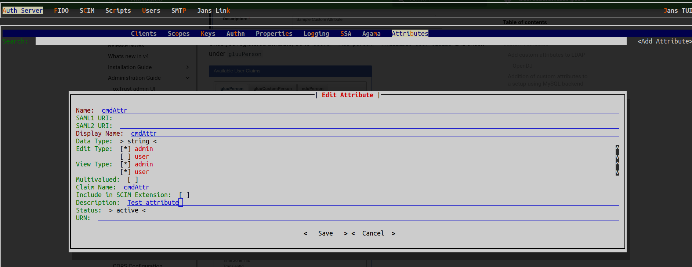

---
tags:
  - administration
  - reference
  - database
  - additional claims to database
  - jansPerson
---

# MySQL Operation

Below operations require to log into mysql workspace first with command: `mysql`

### **Change password for user `jans`** :

*  `ALTER USER 'jans'@'localhost' IDENTIFIED BY 'TopSecret';`
*  `GRANT ALL PRIVILEGES ON jansdb.* TO 'jans'@'localhost';`

### Create new user claims to `jansPerson`: 
* You can add additional attributes to `jansPerson` table and use them. Here DB stores all the user attribute information in one entry. Additional attributes will not affect the server functionality.
* Ensure you restart services after DB schema modification

### **Modify column size of jansPerson** :
Say we want to increase the size of `mail` field to 144. Do the following:<br>
* a. Modify column size - 
 ```
 ALTER TABLE `jansdb`.`jansPerson` CHANGE COLUMN `mail` `mail` VARCHAR(144) NULL DEFAULT NULL ;
 ```
* b. Drop indexes and re-create - 
 ```
 ALTER TABLE jansdb.jansPerson DROP INDEX `jansPerson_CustomIdx2`;
 ALTER TABLE jansdb.jansPerson ADD INDEX `jansPerson_CustomIdx2` ((lower(`mail`)));
 ```
* c. Ensure you restart services after DB schema modification


### Add user in Jans admin group

* Search for inum of `JansGrp`
  * `use jansdb; select * from jansGrp\G;` 
* Add specific user in this group
  * Get `DN` of user
    * `use jansdb; select * from jansPerson where uid='testUser'\G`;
    * Copy `DN` of this user. i.e. `inum=83d43a5d-3311-4c93-ae26-df80c320557a,ou=people,o=jans` 
  * Perform operation: `use jansdb; update jansGrp set member = '{"v": ["inum=e4fe2c89-f588-41a2-aac5-2f1afa63bed1,ou=people,o=jans", "inum=83d43a5d-3311-4c93-ae26-df80c320557a,ou=people,o=jans"]}';` 

### Update user information 

In this example we are doing to update one user's email address. 

* Search for existing email address: `use jansdb; select * from jansPerson where uid='testUser'\G;`
* Modify it: `use jansdb; update jansPerson set mail='newEmail@gluu.org' where uid='testUser';`
### **Search user** : 

* `use jansdb; select * from jansPerson where uid='admin'\G;`

### Add custom attribute

There are three steps here: 

* Create attribute in MySQL database: `ALTER TABLE jansdb.jansPerson ADD COLUMN cmdAttr VARCHAR(64) NULL;`
* Restart the ConfgiApi [service](../../../janssen-server/vm-ops/restarting-services.md#restart). If you are using kubernetes please restart the [deployment](https://kubernetes.io/docs/reference/kubectl/generated/kubectl_rollout/kubectl_rollout_restart/).
* Create attribute using the terraform provider, curl commands, or  TUI: 


!!! Contribute
If you’d like to contribute to this document, get started with the [Contribution Guide](https://docs.jans.io/head/CONTRIBUTING/#contributing-to-the-documentation)
