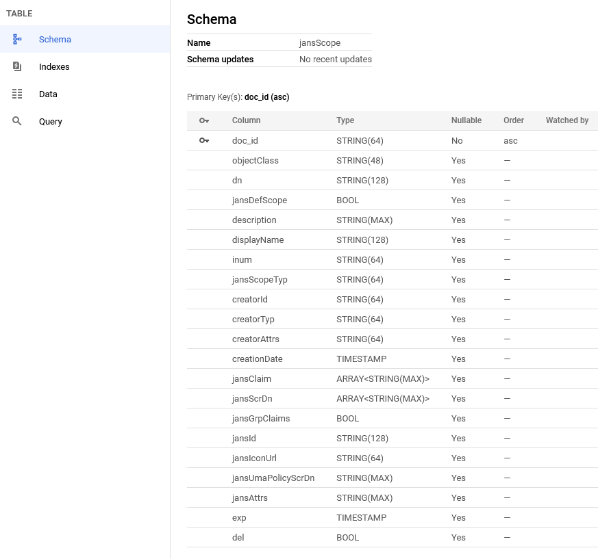
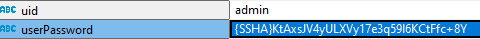

---
tags:
  - administration
  - reference
  - database
---

# Spanner ORM persistence layer

The recommended Spanner version is 6.3x or newer. Setup supports both Spanner emulator and Spanner Cloud DB servers. Spanner emulator has many limitations and it's recommended only for development and testing. For case with Spanner Cloud the administrator should pre-create database and get Google credentials file. During install setup will prompt to enter project/instance/database and path to Google credentials file. After entering these details setup will check connection and start tables creation in specified DB.


During install setup generates default **/etc/jans/conf/jans-spanner.properties** for Jans applications

## Configuration properties

List of specific for Spanner default setting from `jans-spanner.properties`:

```
connection.project=jans-project
connection.instance=jans-instance
connection.database=jansdb

# Prefix connection.client-property.key=value will be coverterd to key=value
# This is reserved for future usage
#connection.client-property=clientPropertyValue

# spanner creds or emulator
#connection.emulator-host=

connection.credentials-file=/etc/jans/google_application_credentials.json

# Password hash method
password.encryption.method=SSHA-256

# Connection pool size
#connection.pool.max-sessions=400
#connection.pool.min-sessions=100
#connection.pool.inc-step=25

# Max time needed to create connection pool in milliseconds
connection.pool.create-max-wait-time-millis=20000

# Maximum allowed statement result set size
statement.limit.default-maximum-result-size=1000

# Maximum allowed delete statement result set size
statement.limit.maximum-result-delete-size=10000

```

The rest of properties are static for all other supported DB:

```
binaryAttributes=objectGUID
certificateAttributes=userCertificate
```

## `doc_id` building rules

In order to support transparency for end applications and allow data migration from one DB to another ORM requires `DN` attribute in each entry. This attribute it also uses to build `doc_id`. Here is example of this `DN` -> `doc_id` conversion:


`doc_id` is primary key. In order to build unique document identifier ORM uses another unique attribute `DN`. `doc_id` is last `RDN` value.

# Generic tables structure

Each table in **jansdb** Spanner schema follow next rules:

1. one table for every LDAP **objectClass**
1. has 2 mandatory column `DN` and `doc_id`
1. Index for primary key
1. Interleaved tables with name pattern **objectClass_propertyName**


# Multi-valued attributes support

Spanner DB supports ARRAY attributes but at same time it's not possible to index them. This led to full table scan when query has filter with these attributes. Alternative for this is to use interleaved child tables. These tables can increase queries performance but in parallel with this this approach requires additional storage space for child table and index. Administrator should move only attributes which need ARRAY index to such tables.

**ARRAY columns:**


**Interleaved columns moved to tables:**


More details about interleaved tables, DB size and performance is in ORM [Spanner](https://github.com/JanssenProject/jans/blob/main/jans-orm/spanner/docs/multi_value_attribute_design.md) module.


## Data mapping rules

ORM uses **STRING / TIMESTAMP / INT64 / BYTES / BOOL / ARRAY<STRING(MAX)>** data types.



`ARRAY` it uses to store multi-valued attribute values. The generic format of such values is:

```
["value_1", "value_2", ...]

```

For user password field ORM on persist/update operations automatically create hash. On authentication ORM compares hashes.



To store attributes defined in java beans with `@JsonObject` annotation ORM uses **STRING(MAX)** column type.


# Java example

This example shows how to use ORM. It opens connection to Spanner DB and add user entry to it:

```
    public static void main(String[] args) {
        // Create Sql entry manager
        SpannerEntryManager spannerEntryManager = createSpannerEntryManager();

        // Create and fill user bean
        SimpleUser newUser = new SimpleUser();
        newUser.setDn(String.format("inum=%s,ou=people,o=jans", System.currentTimeMillis()));
        newUser.setUserId("sample_user_" + System.currentTimeMillis());
        newUser.setUserPassword("test");
        newUser.getCustomAttributes().add(new CustomObjectAttribute("jansAddres", Arrays.asList("London", "Texas", "New York")));
        newUser.getCustomAttributes().add(new CustomObjectAttribute("jansGuid", "test_value"));
        
        // Call ORM API to store entry
        spannerEntryManager.persist(newUser);
        
        spannerEntryManager.destroy();
    }

    public static SpannerEntryManager createSpannerEntryManager() {
    	SpannerEntryManagerFactory spannerEntryManagerFactory = new SpannerEntryManagerFactory();
        spannerEntryManagerFactory.create();
        Properties connectionProperties = getSampleConnectionProperties();

        SpannerEntryManager spannerEntryManager = spannerEntryManagerFactory.createEntryManager(connectionProperties);

        return spannerEntryManager;
    }

    private static Properties getSampleConnectionProperties() {
        Properties connectionProperties = new Properties();

        connectionProperties.put("spanner#connection.project", "jans-project");
        connectionProperties.put("spanner#connection.instance", "jans-instance");
        connectionProperties.put("spanner#connection.database", "jansdb");

        boolean emulator = true;
		if (emulator) {
			connectionProperties.put("spanner#connection.emulator-host", "localhost:9010");
		} else {
			connectionProperties.put("spanner#connection.credentials-file", "V:\\dev-gluu-cloud-platform-32136abdceb7.json");
		}

        // Password hash method
        connectionProperties.put("spanner#password.encryption.method", "SSHA-256");
        
        // Max time needed to create connection pool in milliseconds
        connectionProperties.put("spanner#connection.pool.create-max-wait-time-millis", "20000");

        // # Maximum allowed statement result set size
        connectionProperties.put("spanner#statement.limit.default-maximum-result-size", "1000");

        // # Maximum allowed delete statement result set size
        connectionProperties.put("spanner#statement.limit.maximum-result-delete-size", "10000");

        connectionProperties.put("spanner#binaryAttributes", "objectGUID");
        connectionProperties.put("spanner#certificateAttributes", "userCertificate");

        return connectionProperties;
    }
```

More Spanner ORM examples is in [this](https://github.com/JanssenProject/jans/tree/main/jans-orm/spanner-sample/src/main/java/io/jans/orm/cloud/spanner) sample module.
