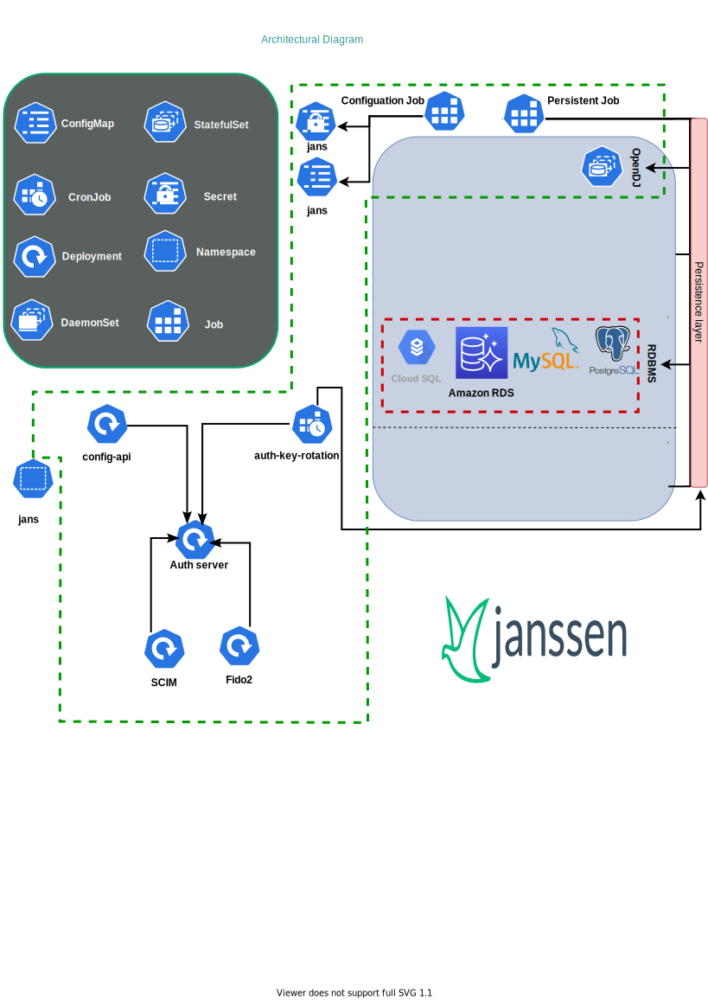

---
tags:
  - administration
  - reference
  - kubernetes
  - architecture
  - components
---

# Kubernetes

This Reference guide helps you learn about the components and architecture of Janssen.

## Janssen components

- **auth-server**: The OAuth Authorization Server, the OpenID Connect Provider, the UMA Authorization Server--this is the main Internet facing component of Janssen. It's the service that returns tokens, JWT's and identity assertions. This service must be Internet facing.
- **auth-key-rotation**: Responsible for regenerating auth-keys per x hours.
- **config-api**: The API to configure the auth-server and other components is consolidated in this component. This service should not be Internet-facing.
- **Fido**: Provides the server side endpoints to enroll and validate devices that use FIDO. It provides both FIDO U2F (register, authenticate) and FIDO 2 (attestation, assertion) endpoints. This service must be internet facing.
- **SCIM**: a JSON/REST API to manage user data. Use it to add, edit and update user information. This service should not be Internet facing.
- **Casa**: self-service web portal for end-users to manage authentication and authorization preferences for their account in a Jannsen Server.

# Image references
| Image                                                                                                                          |
|--------------------------------------------------------------------------------------------------------------------------------|
| [jans-all-in-one](https://github.com/JanssenProject/jans/blob/vreplace-janssen-version/docker-jans-all-in-one/README.md)       |
| [jans-auth-server](https://github.com/JanssenProject/jans/blob/vreplace-janssen-version/docker-jans-auth-server/README.md)     |
| [jans-casa](https://github.com/JanssenProject/jans/blob/vreplace-janssen-version/docker-jans-casa/README.md)                   |
| [jans-cloudtools](https://github.com/JanssenProject/jans/blob/vreplace-janssen-version/docker-jans-cloudtools/README.md)       |
| [jans-config-api](https://github.com/JanssenProject/jans/blob/vreplace-janssen-version/docker-jans-config-api/README.md)       |
| [jans-configurator](https://github.com/JanssenProject/jans/blob/vreplace-janssen-version/docker-jans-configurator/README.md)   |
| [jans-fido2](https://github.com/JanssenProject/jans/blob/vreplace-janssen-version/docker-jans-fido2/README.md)                 |
| [jans-monolith](https://github.com/JanssenProject/jans/blob/vreplace-janssen-version/docker-jans-monolith/README.md)           |
| [jans-persistence](https://github.com/JanssenProject/jans/blob/vreplace-janssen-version/docker-jans-persistence/README.md)     |
| [jans-saml](https://github.com/JanssenProject/jans/blob/vreplace-janssen-version/docker-jans-saml/README.md)                   |
| [jans-scim](https://github.com/JanssenProject/jans/blob/vreplace-janssen-version/docker-jans-scim/README.md)                   |

# Helm Chart references
| Helm Chart                                                                                                                   |
|------------------------------------------------------------------------------------------------------------------------------|
| [All In One Chart](https://github.com/JanssenProject/jans/blob/vreplace-janssen-version/charts/janssen-all-in-one/README.md) |
| [Microservices Chart](https://github.com/JanssenProject/jans/blob/vreplace-janssen-version/charts/janssen/README.md)         |

## Architectural diagram of Janssen

