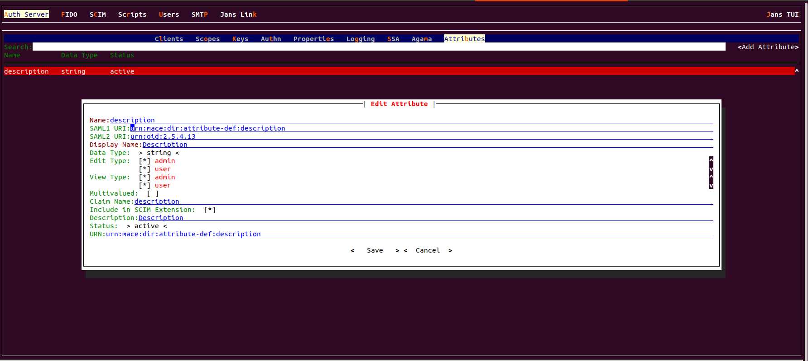
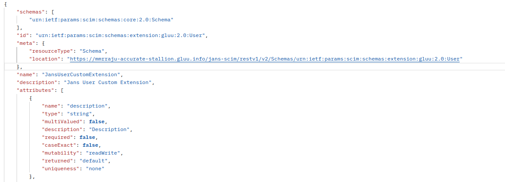
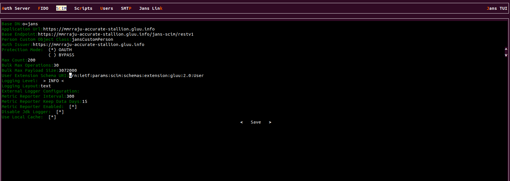

---
tags:
  - administration
  - scim
  - custom-attributes
---

# Custom Attributes

[RFC 7643](https://datatracker.ietf.org/doc/html/rfc7643) defines the schema for resource types in SCIM (see section 3.3). In other words, it defines structures in terms of attributes to represent users and groups as well as attribute types, mutability, cardinality, and so on.

Although the schema covers many attributes one might think of, at times you will need to add your own attributes for specific needs. This is where user extensions pitch in, they allow you to create custom attributes for SCIM. To do so, you will have to:

* Add an attribute to Database schema


* Include the new attribute in an object class such as jansPerson

* Register and activate your new attribute through **Jans TUI**.

Please visit this [page](../config-guide/auth-server-config/attribute-configuration.md) for a more detailed explanation. When registering the attribute in the **TUI**, please ensure you have set the `Include in SCIM Extension` parameter to `true`.



Once you submit this form, your attribute will be part of the `User Extension`. You can verify this by inspecting the `Schema` endpoint:

```bash title="Command"
https://<host-name>/jans-scim/restv1/v2/Schemas/urn:ietf:params:scim:schemas:extension:gluu:2.0:User
```



In the JSON response, your new added attribute will appear.

To customize the URI associated to the extension (whose default value is `urn:ietf:params:scim:schemas:extension:gluu:2.0:User`
), you can use TUI:

* Navigate to `SCIM` using Jans TUI `jans tui`
* Locate the Scim properties section
* Set a value in the field `User Extension Schema URI`
* Save the changes


