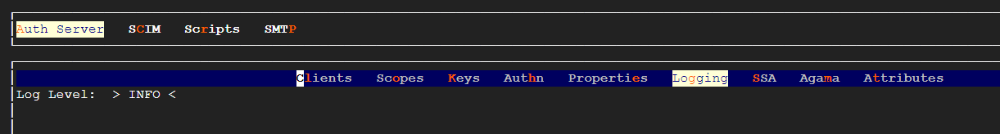
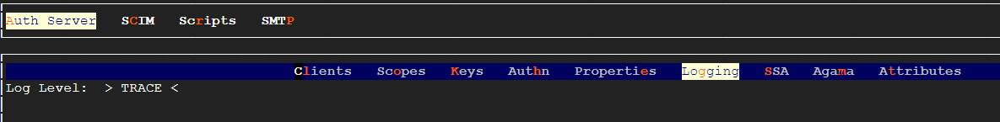

---
tags:
  - administration
  - terraform
  - operations
  - automation
  - IaC
  - Infrastructure as Code
---

## Benefits of Terraform and IaC

**Consistency:** you create one Terraform configuration and use it to configure environments repeatedly.

**Minimized human error:** the configuration is now `as code` and is deployed automatically.

**Fast:** with a single command, you can have all your configuration provisioned.

**Observability:** the configuration are made `as code`, you now have one place to review all the configuration and who changed what.


## Janssen Terraform provider

!!! Note
    Every instance of [Janssen](https://registry.terraform.io/providers/JanssenProject/jans/latest/docs#instance-configuration) comes with a set of configurations, which are valid for the whole instance. These resources cannot be created or destroyed, as they are always present in a Janssen instance. Instead, they can be imported and updated. The creation of such a resource will result in an error. Deletion on the other hand will result in the resource being removed from the state file.

The [Janssen](https://registry.terraform.io/providers/JanssenProject/jans/latest/docs) Terraform provider is used to manage resources in a Janssen deployment. This includes all configurations, users, groups, OIDC clients, and more.

## Directory structure

The directory holding Terraform configuration files may look like the following:

```
|-- versions.tf: specify the required providers, i.e. Janssen, with their respective version 
|-- backend.tf: defines where the state file of the current infrastructure will be stored. Terraform keeps track of the managed resources using the Terraform state file.
|-- variables.tf: specify the variables, with their type and optionally the default values.
|-- configurations.tf: using the Jans provider and creating other resources.
|-- clients.tf: file that holds the configuration for Janssen clients creation if needed.
|-- scopes.tf: file that holds the configuration for Janssen scopes creation if needed.
|-- scripts.tf: file that holds the configuration for Janssen scripts creation if needed.

```

## Example - Configure Janssen

Let's have an example on `importing` the current `logging level` of a deployment and `changing` it using Terraform.

1. Configure Terraform to install the required plugins for the `Janssen provider`. Add this to your `versions.tf` file:

    ```bash
    terraform {
     required_providers {
        jans = {
        source = "JanssenProject/jans"
        version = "1.1.5" #update based on your targeted version
        }
     }
    }
    ```

2.  Now we can run `terraform init`, which will fetch the plugins needed.

3.  In `backend.tf` we define where we store the Terraform state file. By default it's stored locally. However, configuring a remote backend like [S3](https://developer.hashicorp.com/terraform/language/settings/backends/s3) to store the state file allows multiple people to collaborate and work on the same infrastructure.

    ```
    terraform {
        backend "local" {
            path = "relative/path/to/terraform.tfstate"
        }
    }
    ```


4.  Have a `client_id` and `client_secret` with sufficient scopes and permissions.

    - **VM:** grab `client_id` and `client_pw` from `/opt/jans/jans-setup/setup.properties.last` file.

    - **K8s:** 
        1. client_id: `kubectl get cm cn -n <namespace>  --template={{.data.test_client_id}}` 

        2. client_secret: `kubectl get secret cn -n <namespace> --template={{.data.test_client_pw}} | base64 -d`

5.  In your `variables.tf` file, add your `client_id`, `client_secret` and `FQDN`
    ```
    variable "jans_fqdn" {
        description = "Jans FQQN"
        type        = string
        default     = "https://demoexample.jans.io" #Replace with https://<YOUR_DOMAIN>
        }  
        
        variable "jans_client_id" {
        description = "The Jans client id with sufficient scopes"
        type        = string
        default     = "1800.b8c31be4-952b-4770-b1e8-824187e940c9" #Replace with your client id 
        }

        variable "jans_client_secret" {
        description = "The Jans client secret with sufficient scopes"
        type        = string
        default     = "mf7ELLeF6JSI" #Replace with your client secret 
        }
    ```

6.  Configure the provider section in `configurations.tf` file:

    ```
    provider "jans" {
        url           = var.jans_fqdn
        client_id     = var.jans_client_id
        client_secret = var.jans_client_secret
        insecure_client = true # Optional. If set to `true`, the provider will not verify the TLS certificate of the Janssen server. This is useful for testing purposes and should not be used in production, unless absolutely unavoidable.
    }
    ```

7.  Before importing, we have to define a `resource` configuration in `configurations.tf`:

    ```
    resource "jans_logging_configuration" "global" {

    }
    ```

8. Import:
   `terraform import jans_logging_configuration.global global`

    Now after importing, the logging configuration is in the Terraform state file, i.e. terraform.tfstate, and it's under Terraform management.

    `terraform state list` will output:
    ```
    jans_logging_configuration.global
    ```


    You can see the current logging configuration details using `terraform state show jans_logging_configuration.global` which will output something like that: 
    ```
    # jans_logging_configuration.global:
    resource "jans_logging_configuration" "global" {
        disable_jdk_logger          = true
        enabled_oauth_audit_logging = false
        http_logging_enabled        = false
        http_logging_exclude_paths  = []
        id                          = "jans_logging_configuration"
        logging_layout              = "text"
        logging_level               = "INFO"
    }
    ```

    As you can see the current logging level is `INFO`. We can double-check that in the `TUI`
    

9.  Add configuration to your `configuration.tf file`
    ```
    resource "jans_logging_configuration" "global" {
    logging_level = "TRACE"
    }
    ```

10. You can run `terraform fmt` to rewrite Terraform configuration files to a canonical format and style.

11.  You can validate your Terraform syntax using `terraform validate`

12.  Plan and then apply changes using `terraform plan` and `terraform apply` respectivley.

13.  Review the changes now using `terraform state show jans_logging_configuration.global`. 
    Now it should show `logging_level               = "TRACE"`.


14.  We can double-check the `logging level` in the TUI 
         

!!! Note
    You can find the full list of resources you can import and manage using Terraform under the `Resources` sidebar in the Janssen Terraform [documentation](https://registry.terraform.io/providers/JanssenProject/jans/latest/docs)

