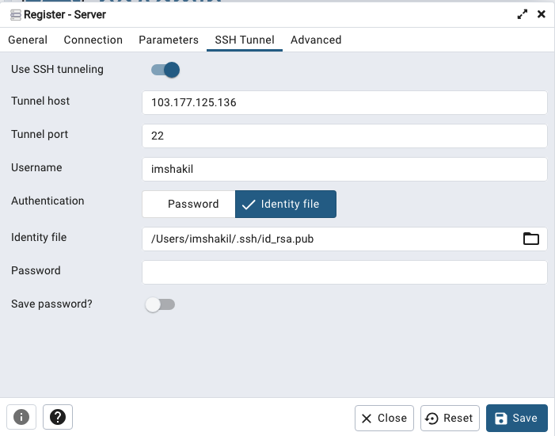
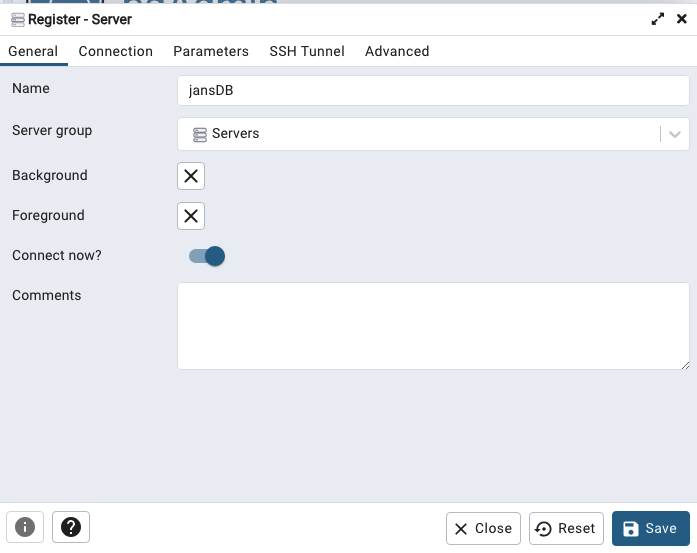
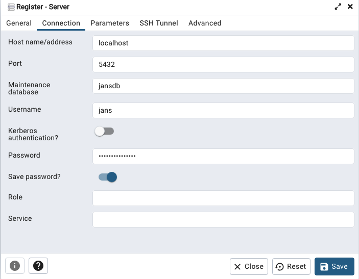

---
tags:
  - administration
  - user management
---

# Local User Management

In this document we will cover managing people in the Jans Server's LDAP Directory, Jans CLI / TUI and using SCIM.

=== "Manage Data using DB Browser"

    You can manage your Janssen Server's data using external tool provided by specific DB. Jump into [Manage RDBMS Data](#manage-data-in-rdbms) section for guidelines to explore Janssen Server's data using [pgAdmin](https://www.pgadmin.org/).

=== "User Management using SCIM"

    SCIM allows many ways to manage users data. Jump into the [SCIM User Management](../config-guide/scim-config/user-config.md) for guidelines of SCIM operations. To know how SCIM works in Janssen Server, read more from [here](../scim/README.md).
    
=== "Manage External Data Sources Using Link"

    Janssen Server allows connecting external data sources using Jans Link. Syncing people and attributes from a backend server speeds up authentication transactions. It is possible to perform attribute transformations, changing the name of attributes, or even using an interception script to change the values. Transformations are stored locally in Janssen Server. Read out [Link Guide](../link/README.md) to know more details on it.
    

## Manage Data in RDBMS

During the Janssen server installation, you can choose any of the supported RDBMS from the list; like mysql, or postgreSQL. In this article, We will connect postgreSQL database locally to explore `jansDB`. Let's see how we can connect PostgreSQL DB from jans server to your local PC.

### Get PostgreSQL DB Information

Let's get the postgreSQL databse information from the Janssen server properties which is located in `/opt/jans/jans-setup/setup.properties.last`. Run the following command:

```bash title="Command"
cat /opt/jans/jans-setup/setup.properties.last | grep 'rdbm_'
```

It should print details like below:

```text title="Output"
rdbm_db=jansdb
rdbm_host=localhost
rdbm_install=True
rdbm_install_type=1
rdbm_password=xxxxxxxx
rdbm_password_enc=xxxxxxxxxxxxx\=\=
rdbm_port=5432
rdbm_type=pgsql
rdbm_user=jans
static_rdbm_dir=/opt/jans/jans-setup/static/rdbm
```

### Create SSH Tunnel

You can create a SSH tunnel with the Janssen Server's database using the following command:

```
ssh -fNL 5432:localhost:5432 [user]@[janssen-server-host]
```

Or using `pgAdmin`'s SSH tunnel option:



### Add Database in **`pgAdmin`**

Let's open pgAdmin in your local pc, and add a server.



Go to `Connection` tab add the database as following in the image below:



Finally, save it and explore.

## Want to contribute?

If you have content you'd like to contribute to this page in the meantime, you can get started with our [Contribution guide](https://docs.jans.io/head/CONTRIBUTING/).
