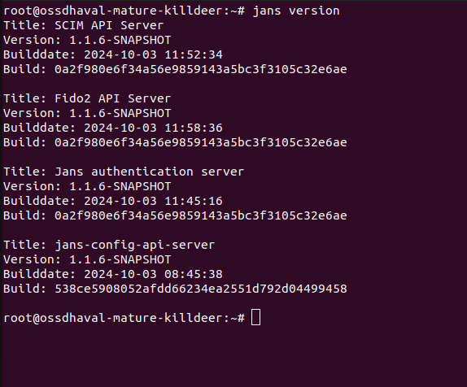
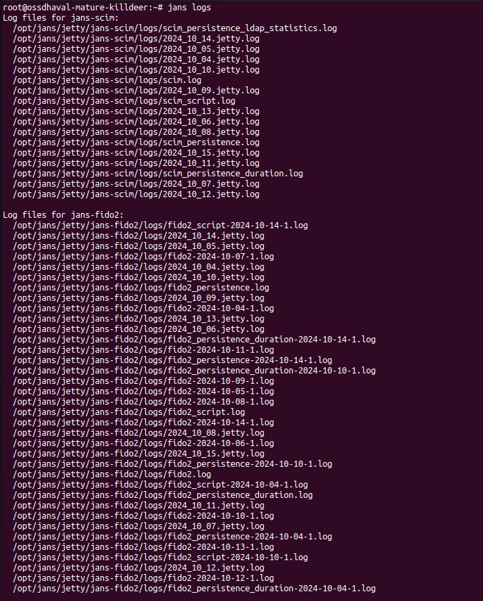
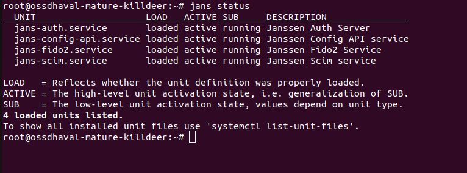
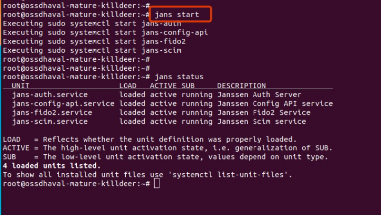
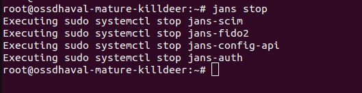
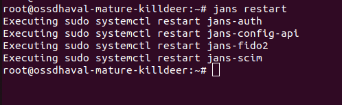
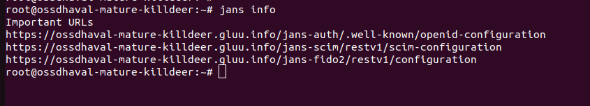

---
tags:
- administration
- vm
- operations
- jans wrapper command
---


# Jans Command Overview

The `jans` command is a top-level wrapper script for managing the Janssen Server. 
This guide provides an overview of its usage and available commands. List of 
available commands may change as more commands are added. To see the current
list of commands available in your installation, run following command at the
Janssen Server:

```bash title="Command"
jans
```

## Available Commands

### Version and build information

Displays the version and build information of the currently installed 
Janssen Server.

```bash title="Command"
jans version
```



### CLI

Invokes the Janssen Command-Line Interface.

```bash title="Command"
jans cli
```

### TUI

Launches the text-based user interface for Janssen.

```bash title="Command"
jans tui
```
     
### Logs

Shows the log file paths for various Janssen Server modules. 

```bash title="Command"
jans logs
```



### Status

Displays the status of Janssen Server module services.

```bash title="Command"
jans status
```



### Start 

Starts services for the Janssen Server.

```bash title="Command"
     jans start
```


Start a specific service.

```bash title="sample command"
jans start -service=jans-config-api
```

```title="Sample Output"
Executing sudo systemctl start jans-config-api
```


### Stop

Stops services for the Janssen Server.
```bash title="Command"
jans stop
```



Stop a specific service.

```bash title="Command"
jans stop -service=jans-config-api
```
```title="Sample Output"
Executing sudo systemctl stop jans-config-api
```


### Restart 

Restart services for the Janssen Server.

```bash title="Command"
jans restart
```


Restart a specific service.

```bash title="Sample Command"
jans restart -service=jans-config-api
```

```title="Sample Output"
Executing sudo systemctl restart jans-config-api
```


### Health

Retrieves health status from the Janssen services health-check endpoint.

```bash title="Command"
jans health
```


Health check for specific service.

```bash title="Command"
jans health -service=<service-name>
```

```title="sample Output"
Checking health status for jans-config-api
  Executing curl -s http://localhost:8074/jans-config-api/api/v1/health/live
  Command output: {"name":"jans-config-api liveness","status":"UP"}
```


### Info

Lists important URLs such as `.well-known` endpoints.

```bash title="Command"
jans info
```



