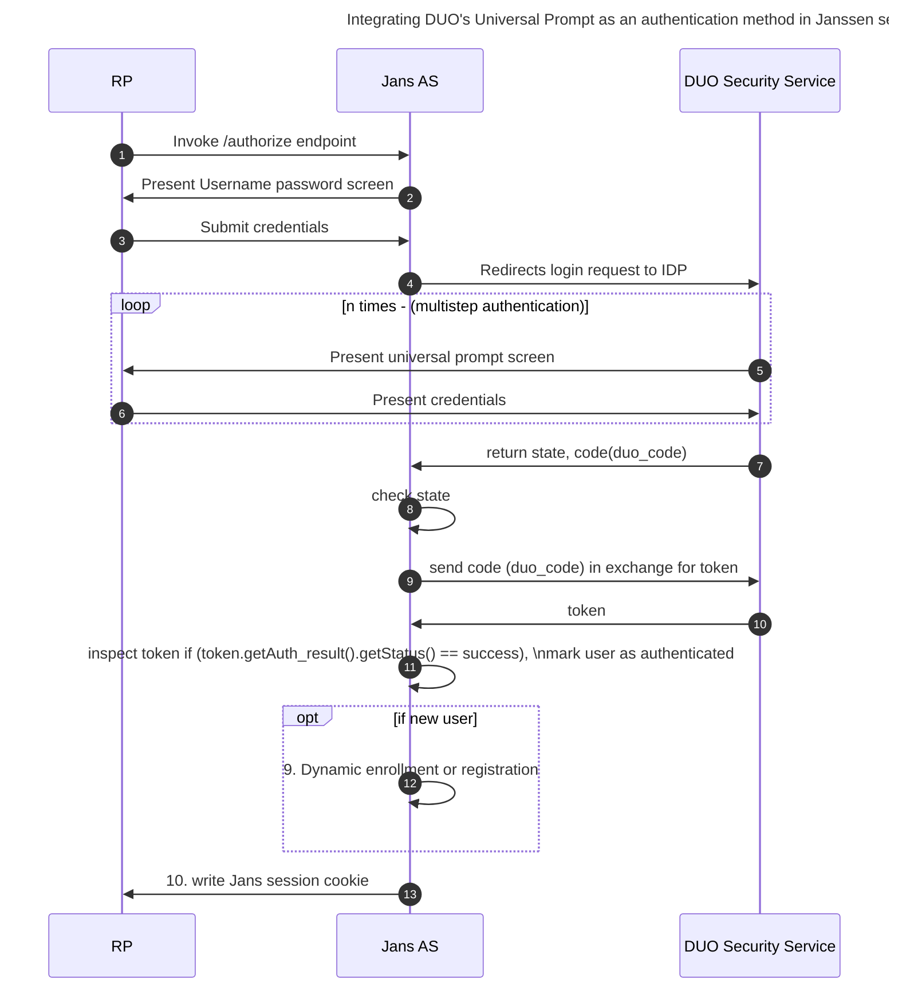

## Integrating DUO's Universal Prompt as an authentication method in Janssen server

[Duo Security](https://duosecurity.com) is a SaaS authentication provider. This document will explain how to use Janssen's [Duo interception script](https://github.com/JanssenProject/jans/blob/replace-janssen-version/docs/script-catalog/person_authentication/duo-external-authenticator/DuoExternalAuthenticator.py) to configure the Janssen Server for a two-step authentication process with username and password as the first step, and Duo as the second step. The script invokes the Universal Prompt which is a redesign of Duo’s traditional authentication prompt. 

## Authentication flow


## Administrator prerequisites
- [Duo interception script](https://github.com/JanssenProject/jans/blob/replace-janssen-version/docs/script-catalog/person_authentication/duo-external-authenticator/DuoExternalAuthenticator.py) (included in the default Janssen Server distribution);
- An account with [Duo Security](https://duo.com/).   

## User prerequisites
- Users should download the [DUO mobile app](https://duo.com/product/multi-factor-authentication-mfa/duo-mobile-app)

## Configure Duo Account

1. [Sign up](https://duo.com/) for a Duo account.

2. Log in to the Duo Admin Panel and navigate to Applications.

3. Click Protect an Application and locate Web SDK in the applications list. Click Protect this Application to get your client ID, secret key, and API hostname.

For additional info for the steps refer to Duo's Web SDK 4, check [this article](https://duo.com/docs/duoweb-v4). 

## Configure Jans-auth server (AS)
### 1. Add the duo-universal Dependency to your jans-auth server
The dependencies have to be added separately as mentioned in the steps below. Using a fat jar (duo-universal-sdk-1.0.3-with-dependencies.jar leads to conflicts.)

 - [ ] Copy these jar files to the following jans-auth folder inside the Janssen Server chroot: `/opt/jans/jetty/jans-auth/custom/libs`
<br/>Dependency jars: 
		<br/>* [duo-universal-sdk-1.0.3.jar](https://repo1.maven.org/maven2/com/duosecurity/duo-universal-sdk/1.0.3/duo-universal-sdk-1.0.3.jar) ,
                <br/>* [converter-jackson-2.1.0.jar](https://repo1.maven.org/maven2/com/squareup/retrofit2/converter-jackson/2.1.0/converter-jackson-2.1.0.jar) ,
                <br/>* [java-jwt-3.3.0.jar](https://repo1.maven.org/maven2/com/auth0/java-jwt/3.3.0/java-jwt-3.3.0.jar),
                <br/>* [logging-interceptor-3.3.1.jar](https://repo1.maven.org/maven2/com/squareup/okhttp3/logging-interceptor/3.3.1/logging-interceptor-3.3.1.jar),
                <br/>* [lombok-1.18.16.jar](https://repo1.maven.org/maven2/org/projectlombok/lombok/1.18.16/lombok-1.18.16.jar),
                <br/>* [retrofit-2.5.0.jar](https://repo1.maven.org/maven2/com/squareup/retrofit2/retrofit/2.5.0/retrofit-2.5.0.jar),
                <br/>* [okio-2.9.0.jar](https://repo1.maven.org/maven2/com/squareup/okio/okio/2.9.0/okio-2.9.0.jar),
                <br/>* [okhttp-3.12.0.jar](https://repo1.maven.org/maven2/com/squareup/okhttp3/okhttp/3.12.0/okhttp-3.12.0.jar),
                <br/>* [kotlin-stdlib-1.4.21.jar](https://repo1.maven.org/maven2/org/jetbrains/kotlin/kotlin-stdlib/1.4.21/kotlin-stdlib-1.4.21.jar)	 
 - [ ] Edit /opt/jans/jetty/jans-auth/webapps/jans-auth.xml and add the following line:
`<Set name="extraClasspath">./custom/libs/duo-universal-sdk-1.0.3.jar,./custom/libs/converter-jackson-2.1.0.jar,./custom/libs/java-jwt-3.3.0.jar,./custom/libs/logging-interceptor-3.3.1.jar,./custom/libs/lombok-1.18.16.jar,./custom/libs/retrofit-2.5.0.jar,./custom/libs/okio-2.9.0.jar,./custom/libs/okhttp-3.12.0.jar,./custom/libs/kotlin-stdlib-1.4.21.jar</Set>`
 - [ ] Restart the `jans-auth` service


### 2. Add custom script

1. Create `cs.json` with the contents of a CUSTOM script. To do that, run the following command.
```
/opt/jans/jans-cli/config-cli.py --schema CustomScript > /tmp/cs.json
```
2. Edit the file's contents to reflect the addition of the duo custom script. 
 *  Set enabled flag `true`
 *  Configure the api_hostname, client_id and client_secret
     |	Property	|Status		|	Description	|	Example		|
     |-----------------------|---------------|-----------------------|-----------------------|
     |api_hostname		|Mandatory     |URL of the Duo API Server|api-random.duosecurity.com|
     |client_id		|Mandatory    |Value from the Duo application using Web SDK 4 that was registered using DUO Admin console|DI3ICTTJKLL8PPPNGH7YI|
     |client_secret	|Mandatory|Value from the Duo application using Web SDK 4 that was registered using DUO Admin console|eEbJdi3hg42zxyFYbHArU5RuioPP|   
   
  *  `name` field should reflect the use case
  *  `script_type` should be `PERSON_AUTHENTICATION`

```

{
  "dn": null,
  "inum": null,
  "name": "duo",
  "aliases": [],
  "description": "DUO's custom script",
  "script": "_file /root/script.py",
  "scriptType": "PERSON_AUTHENTICATION",
  "programmingLanguage": "JYTHON",
  "moduleProperties": {
    "value1": null,
    "value2": null,
    "description": null
  },
  "configurationProperties": 

[{
  	"value1": "api_hostname",
  	"value2": "api-random.duosecurity.com",
  	"description": "URL of the Duo API Server",
  	"hide": true
  },
{
  	"value1": "client_id",
  	"value2": "DI3ICTTJKLL8PPPNGH7YI",
  	"description": "Value from the Duo application using Web SDK 4 that was registered using DUO Admin console",
  	"hide": true
  },
  {
  	"value1": "client_secret",
  	"value2": "eEbJdi3hg42zxyFYbHArU5RuioPP",
  	"description": "Value from the Duo application using Web SDK 4 that was registered using DUO Admin console",
  	"hide": true
  }
]
,
  "level": "integer",
  "revision": 0,
  "enabled": true,
  "scriptError": {
    "raisedAt": null,
    "stackTrace": null
  },
  "modified": false,
  "internal": false
}
```
3. Add the custom script 
```
/opt/jans/jans-cli/config-cli.py --operation-id post-config-scripts --data /tmp/cs.json
```

Now Duo is an available authentication mechanism for your Janssen Server. This means that, using OpenID Connect `acr_values`, applications can now request Duo authentication for users. 

!!! Note 
    To make sure Duo has been enabled successfully, you can check your Janssen Server's OpenID Connect configuration by navigating to the following URL: `https://<hostname>/.well-known/openid-configuration`. Find `"acr_values_supported":` and you should see `"duo"`. 

## Make Duo the Default Authentication Mechanism
For CURL commands, use this [link](https://github.com/JanssenProject/jans/blob/replace-janssen-version/docs/admin/config-guide/curl.md#2-enable-an-authentication-script) as a reference.

Steps:
1. Create a file say `duo-auth-default.json` with the following contents
```
{
  "defaultAcr": "duo"
}
```
2.Update the default authentication method to Google Sign-in
```
/opt/jans/jans-cli/config-cli.py --operation-id put-acrs --data /tmp/duo-auth-default.json
```
:memo: **NOTE**

To make sure `duo` has been enabled successfully as a default authentication method, you can check your Janssen Server's OpenID Connect configuration by navigating to the following URL: `https://<hostname>/.well-known/openid-configuration`. Find `"acr_values_supported":` and you should see `"duo"`. 

## Test the feature 
To test , enter the complete URL for authorization in a browser or create a simple web page with a link that simulates the user sign-in attempt. If the server is configured properly, the first page for the selected authentication method will be displayed to the user.

An example of a complete URL looks like this -
```
https://<your.jans.server>/jans-auth/authorize.htm?response_type=code&redirect_uri=https://<your.jans.server>/admin&client_id=<replace_with_inum_client_id>&scope=openid+profile+email+user_name&state=faad2cdjfdddjfkdf&nonce=dajdffdfsdcfff
```

