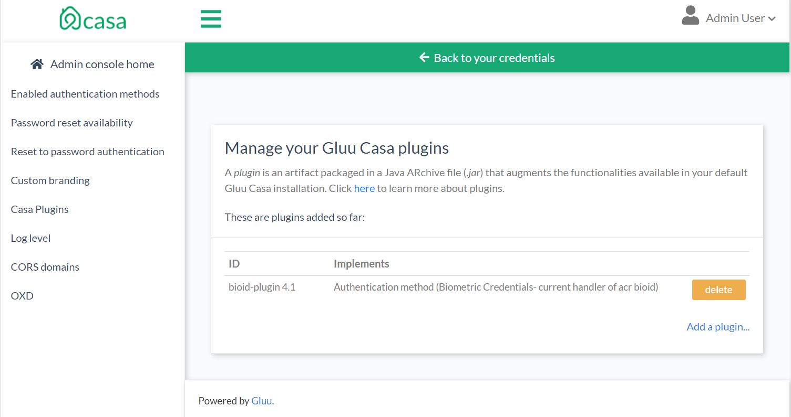
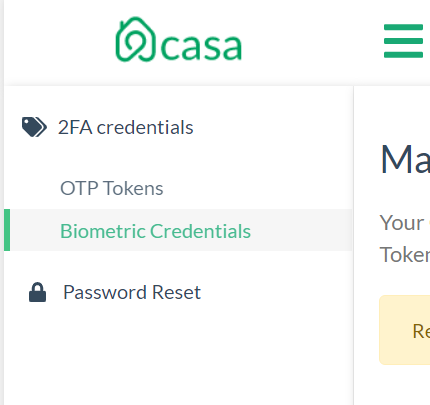
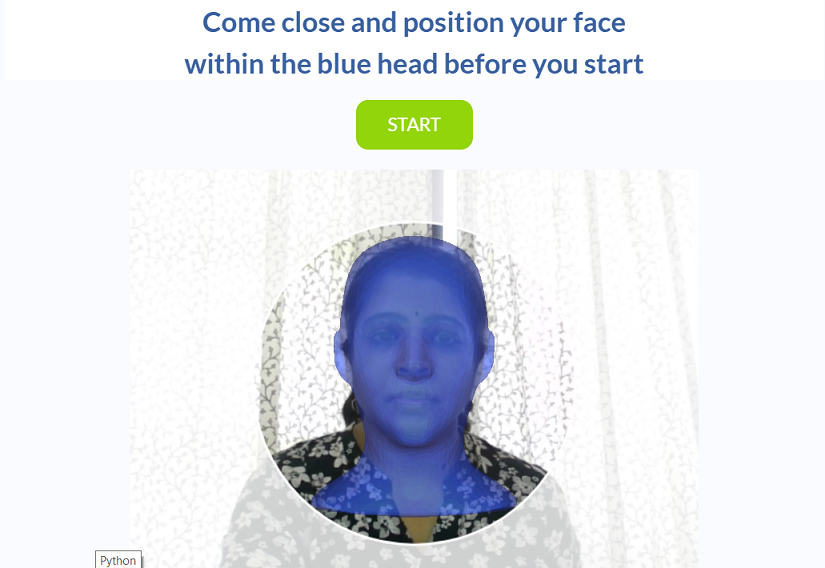
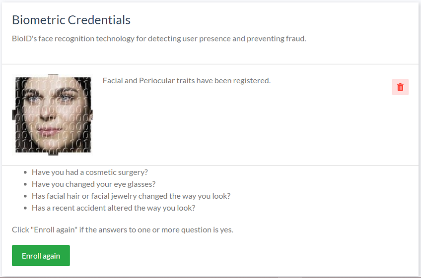

# Integrating BioID's biometric authentication with Casa

## BioID Web Service
[BioID Web Service](https://www.bioid.com) is a "Biometrics as a service" provider. This document will explain how to use Janssen Server [BioID interception script](./BioIDExternalAuthenticator.py) along with a Plugin in Casa to enroll a user's biometric traits and use it is as a method for 2FA.

In order to use this authentication mechanism your organization will need to register for a BioID account.

## Prerequisites
- A Janssen Server
- [BioID interception script](./BioIDExternalAuthenticator.py).
- An account with [BioID](https://bwsportal.bioid.com/register).

## Configure BioID Account

1. [Sign up](https://bwsportal.bioid.com/register) for a BioID account.

2. Upon registration, you will recieve an email with the instance name (listed as STORAGE in Janssen Server's BioID authentication script), partition number(listed as PARTITION in Janssen Server's BioID authentication script).

3. As the owner of this instance, you are entitled to access BWS Portal at https://bwsportal.bioid.com using the account associated with your email.
   With the BWS Portal, you can do the following:  
   a. View your trial information such as your credentials (e.g. your client certificate), enrolled classes, BWS logs and more.  
   b. Create your App ID and App secret, under "Web API keys".

## BioID Documentation

1. You can find all API reference at https://developer.bioid.com/bwsreference.
2. Lots of useful information about BWS is available at https://developer.bioid.com/blog.
3. For liveness detection, you will find information about motion trigger helpful: https://developer.bioid.com/app-developer-guide/bioid-motion-detection

## Script configurations

Log into oxTrust, and go to `Configuration` > `Person Authentication scripts` > `Add custom script configuration`.
### Script contents

Download this [file](./BioIDExternalAuthenticator.py) and copy its contents in the `Script` form field.

### Properties
The mandatory properties in the BioID authentication script are as follows
|	Property	|	Description	|	Example		|
|---------------|---------------|---------------|
|ENDPOINT 		|URL of the BioID Web Service|`https://bws.bioid.com/extension/`|
|APP_IDENTIFIER 	|API key |`c20b04cc-776a-45ed-7a1f-06347f8edf6c`|
|APP_SECRET 	|API secret |`sTGB4n4HAkvc2BnJp6KeNUTk`|
|STORAGE 	|The storage name assigned by BioID depending on the type of contract you have. |`bws`|
|PARTITION 	|A number assigned to your company by BioID. |`12345`|

### Save changes

Click on `Enable` under the script contents box, and press `Update` at the bottom of the page.

## Plugin installation

### Add the plugin to Casa

1. [Download the plugin](https://maven.gluu.org/maven/org/gluu/casa/plugins/bioid-plugin/4.5.0.Final/bioid-plugin-4.5.0.Final-jar-with-dependencies.jar)

1. Log in to Casa using an administrator account

1. Visit `Administration console` > `Casa plugins`

   

1. Click on `Add a plugin...` and select the plugin jar file

1. Click on `Add`

Alternatively you can log into Janssen Server and copy the jar file directly to `/opt/jans/jetty/jans-casa/plugins`.

### Enable the authentication method

Wait for one minute, then visit `Administration Console` > `Enabled methods` and tick `bioid`. On the right, the plugin will be selected by default. Finally save the changes.

## Testing
So far, users that log into Casa should be able to see a new entry "Biometric credentials" that will appear under "2FA credentials" .

From there they can enroll their biometric traits.
The steps to enroll your facial and periocular traits are self explanatory. Follow the instructions on the web page.
You can enroll again or delete your credentials by visiting your registered credential.

Note - When you first use BioID you may wish to enroll a few times at different times of days or in different locations under a variety of environmental conditions. Once you can be reliably recognized, you only need to enroll again if something in your face changes significantly (such as after an accident or cosmetic surgery, or if you radically change eyeglasses, facial hair, facial jewelry, etc.) or if you often have to try more than once to be recognized. Once recognized, BioID typically adjusts itself to adapt to the changes right away.

### Use the biometric credential as a second factor
Ensure you have added another credential, hopefully of a different kind, for example a mobile phone number or an OTP token. Then visit the home page and click the toggle to turn 2FA on and logout.
Try to access the application once more and supply the username and password for the account recently used to enroll the biometric credential. Depending on the numeric level assigned to the `bioid` script, you will be prompted for a different factor, for instance, to enter an OTP code. If so, click on `Try an alternative way to sign in` and click on `Biometric credential`.

Follow the instructions on the screen for verification of facial and periocular traits.

Finally, you will be redirected and get access to the application.

