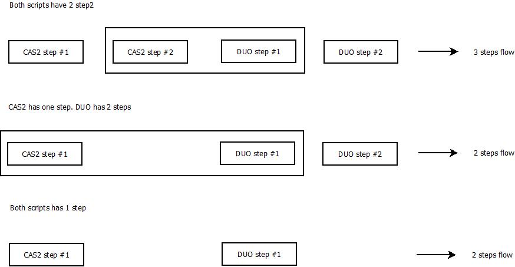

# Description

This script uses CAS2 and DUO scripts. Hence both script properties should be added.

Before deploying it user should do:
1. Put Cas2ExternalAuthenticator.py and DuoExternalAuthenticator.py into `/opt/gluu/python/libs`.
  - `wget -c https://raw.githubusercontent.com/GluuFederation/oxAuth/master/Server/integrations/duo/DuoExternalAuthenticator.py`
  - `wget -c https://raw.githubusercontent.com/GluuFederation/oxAuth/master/Server/integrations/cas2/Cas2ExternalAuthenticator.py`
  
2. chown -R root:gluu /opt/gluu/python/libs

3. Restart oxAuth service with: `service oxauth stop` and `service oxauth start`

## Joining flows

This diagram illustrates how script join CAS2 and DUO scripts internally. Result authentication flow can be 2 or 3 steps.

## Configuration: 

 - Name: CAS2DuoExternalAuthenticator
 - Description: First AuthN with CAS server; 2FA with Gluu Server's Duo
 - Programming Lanauge: Python / Level: 100
 - Location Type: Ldap / Usage type: Web
 - Custom property ( key/value ): 
   - `cas_map_user`: false
   - `cas_review_opt`: true
   - `cas_host`: [hostname_of_cas_server]
   - `duo_creds_file`: /etc/certs/duo_creds.json
   - `duo_host`: [api-abcd.duosecurity.com]
 - Script: 
   - Grab script and enable
