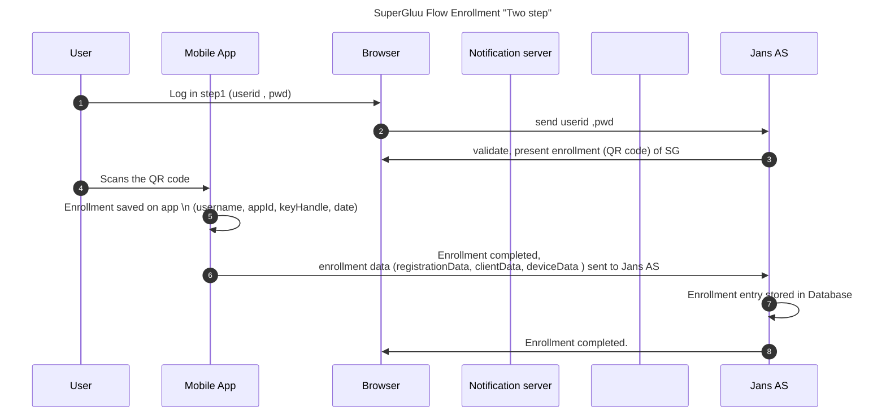
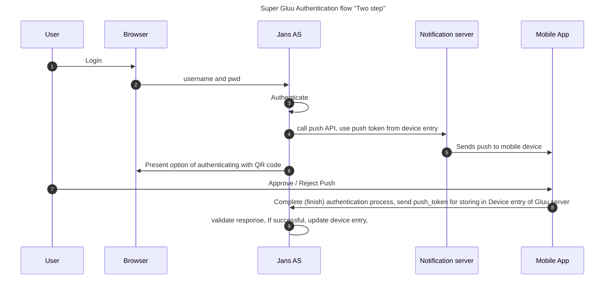
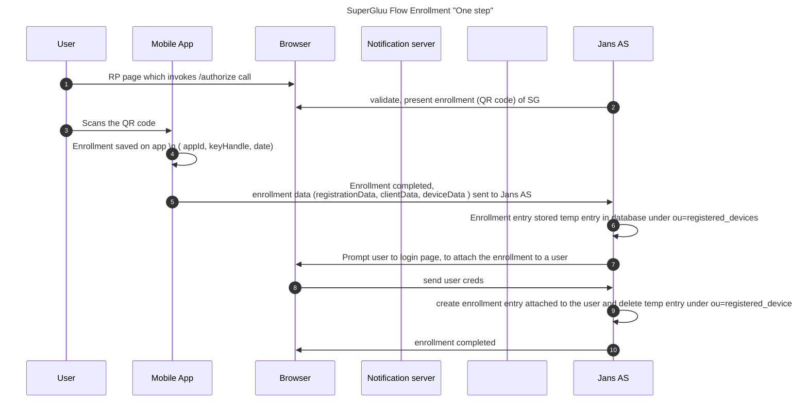
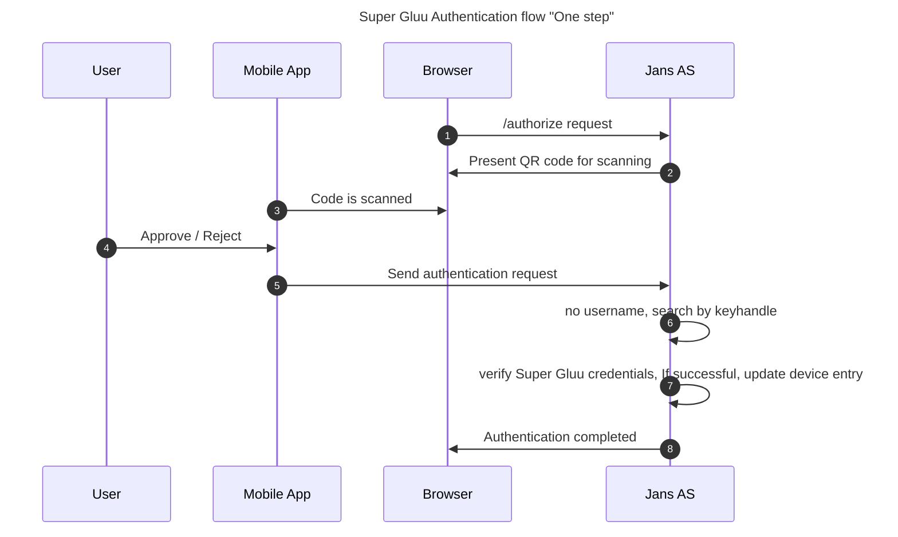

[Super Gluu](supergluu.md) is a push-notification two-factor authentication (2FA) mobile app built to work with the Janssen Server. 

### Janssen Server's FIDO U2F endpoint
Super Gluu uses public-key encryption as specified in the [FIDO U2F authentication standard](https://fidoalliance.org/specifications/overview/). Upon device enrollment, Super Gluu registers its public key against the Janssen Server's FIDO U2F endpoint. When authentication happens, there is a challenge response to ensure that the device has the corresponding private key. 

The URI to invoke registeration and authentication of Super Gluu credentials in the Janssen Auth Server can be found at `https://<my.jans.server>/.well-known/fido-configuration`

### User and Developer Guides
User and Developer Guides can be found on the [Super Gluu docs site](https://gluu.org/docs/supergluu). 

### Prerequisites 
- An Internet accessible (non-internal or localhost) Janssen Server with DNS pointing at the public Internet address of the server 

- [Super Gluu interception script](https://github.com/JanssenProject/jans/blob/replace-janssen-version/docs/script-catalog/person_authentication/super-gluu-external-authenticator/SuperGluuExternalAuthenticator.py) (included in the default Janssen Server distribution)

- An Android or iOS device with Super Gluu installed 
    - [Super Gluu for iOS](https://itunes.apple.com/us/app/super-gluu/id1093479646?mt=8)     
    - [Super Gluu for Android](https://play.google.com/store/apps/details?id=gluu.org.super.gluu)   

- If the Jannsen Server is using a self-signed certificate, `Trust All` **must** be enabled in Super Gluu (open the app, navigate to `Menu` > `Trust all (SSL)` and enable)

!!! Note
    The Janssen Server and Super Gluu can work in the same network, without a DNS server hostname and with a self-signed certificate. There is only one limitation: both components should belong to the same network. Instead of assigning a hostname during Janssen Server installation, an IP address can be specified. In the Super Gluu mobile app, enable `Trust all (SSL)`.    

### Authentication Workflows
The authentication workflow for Super Gluu is defined in the [Super Gluu interception script](https://github.com/JanssenProject/jans/blob/replace-janssen-version/docs/script-catalog/person_authentication/super-gluu-external-authenticator/SuperGluuExternalAuthenticator.py) (included in the default Janssen Server distribution). 
### A. Default Two step flow:
#### Enrollment:
By default, users are put through a two-step, two-factor authentication process with username and password first, and then push notification via Super Gluu second. 

##### A. Client data 
An example of the contents of client data are as follows:
```
{
  "typ": "navigator.id.finishEnrollment",
  "challenge": "Bkpin2iUSEQrkuSC_wDlPwzLfVwRGxLbySpVm8jwkuk",
  "origin": "https://my.jans.server"
}
``` 

##### B. Device data  
An example of the contents of client data are as follows:

```
{
  "uuid": "BBA72798-9A1C-4866-819F-819C011ED129",
  "type": "iPhone",
  "platform": "ios",
  "name": "ABC’s iPhone",
  "os_name": "iOS",
  "os_version": "15.4",
  "custom_data": null,
  "push_token": "8fc4bd31e2ddbc5c5d83e4955cfd36f663ab37b426d0a4ec5c685c3a6335dd2c"
}
```
The push_token is used by the Notification server.

##### C. Device data
This data contains following information: counter, status, rp-application, userInum, keyHandle, Public Key, attestation certificates

#### Authentication:


### B. One step flow
An alternative authentication workflow, password-less authentication, can be configured by adjusting the script property `authentication_mode`. 




### Custom script Properties
The Super Gluu authentication script has the following properties: 

|	Property	|	Description		|	Example	|
|-----------------------|-------------------------------|---------------|
|authentication_mode	|Determine factor of authentication - `two_step` or `one_step`|two_step |
|credentials_file	|JSON file for SuperGluu 		|/etc/certs/super_gluu_creds.json|
|label  |The name of the application |   Super Gluu| 
|notification_service_mode   | Service used to enable push notifications | gluu|
|qr_options| Size of the QR code that is used for enrollment and/or authentication|{ size: 500, mSize: 0.05 }|
|registration_uri | Registration endpoint of the IDP| https://idp.example.com/identity/register| 
|supergluu_android_download_url| Android app download link, used in the login page | https://play.google.com/store/apps/details?id=gluu.super.gluu|
|supergluu_ios_download_url| iOS app download link, used in the login page | https://itunes.apple.com/us/app/super-gluu/id1093479646|


### Notes for administrator:
#### A. Configure `/etc/certs/super_gluu_creds.json`:
for each Android and apple app: 
* a. GCM API key **OR**
* b. SNS platform_arn **OR**
* c. Access key / Secret key of oxNotify server (which hides the creds of GCM or SNS)

#### B. Notification server: 
Configure `accessKeyId` and `secretAccessKey` which allows access to SNS services / GCM services -  `/etc/gluu/conf/oxnotify-access.json`


### Enable Sign-in with Super-Gluu Authentication script
Using the OpenID Connect acr_values parameter, web and mobile clients can request any enabled authentication mechanism. To enable Super Gluu as an authentication method, follow the steps below:

1. Obtain the json contents of `super_gluu` custom script by using a jans-cli command like `get-config-scripts-by-type`, `get-config-scripts-by-inum` etc.

e.g : `/opt/jans/jans-cli/config-cli.py --operation-id get-config-scripts-by-type --url-suffix type:PERSON_AUTHENTICATION `, `/opt/jans/jans-cli/config-cli.py --operation-id get-config-scripts-by-inum --url-suffix inum:6122281b-b55d-4dd0-8115-b098eeeee2b7`

2. Update the custom script and change the enabled attribute to `true`
Now Sign-in with Super-Gluu is an available authentication mechanism for your Janssen Server. This means that, using OpenID Connect acr_values, applications can now request Super-Gluu authentication for users.

!!! Note To make sure `super_gluu` has been enabled successfully, you can check your Janssen's Auth Server OpenID Connect configuration by navigating to the following URL: https://<hostname>/.well-known/openid-configuration. Find "acr_values_supported": and you should see "super_gluu".

### Make Sign-in with Super-Gluu Script as default authentication script:

Use this [link](https://github.com/JanssenProject/jans-cli-tui/blob/replace-janssen-version/docs/cli/cli-default-authentication-method.md) as a reference.

Steps:
1. Create a file say `sg-auth-default.json` with the following contents
```
{
  "defaultAcr": "super_gluu"
}
```
2.Update the default authentication method to super_gluu
```
/opt/jans/jans-cli/config-cli.py --operation-id put-acrs --data /tmp/sg-auth-default.json
```

### Test the feature 
To test, enter the complete URL for authorization in a browser or create a simple webpage with a link that simulates the user sign-in attempt. If the server is configured properly, the first page for the selected authentication method will be displayed to the user.

An example of a complete URL looks like this -
```
https://<your.jans.server>/jans-auth/authorize.htm?response_type=code&redirect_uri=https://<your.jans.server>/admin&client_id=<replace_with_inum_client_id>&scope=openid+profile+email+user_name&state=faad2cdjfdddjfkdf&nonce=dajdffdfsdcfff
```

### Customizations to Super Gluu Login Pages

The Gluu Server includes a [default public-facing pages for Super Gluu ](https://github.com/JanssenProject/jans/blob/replace-janssen-version/jans-auth-server/server/src/main/webapp/auth/super-gluu/login.xhtml) for enrollment and authentication.

To customize the look and feel of the pages, follow the [customization guide](https://github.com/JanssenProject/jans/blob/replace-janssen-version/docs/admin/developer/customization/customize-web-pages.md). 
 
### Self-service 
To offer end-users a portal where they can manage their own account security preferences, including two-factor authentication credentials like Super Gluu, check out our new app, [Gluu Casa](https://casa.gluu.org). 

### Manual Device Management


A user's Super Gluu device(s) can be removed by a Janssen administrator by directly locating the user entry in LDAP. For example, let's say user `abc` loses their device and wants to enroll a new device to use Super Gluu. 
    
1. Find the `DN` of the user in LDAP 
    
1. Find the `jansId DN` associated with the user
    
1. Remove the `jansId DN` 

Now the old device is gone and the user can enroll a new device 
 
### Device management using SCIM
See the [SCIM documentation](...) for a discussion on how to manage FIDO devices, including Super Gluu, using the SCIM protocol. 


