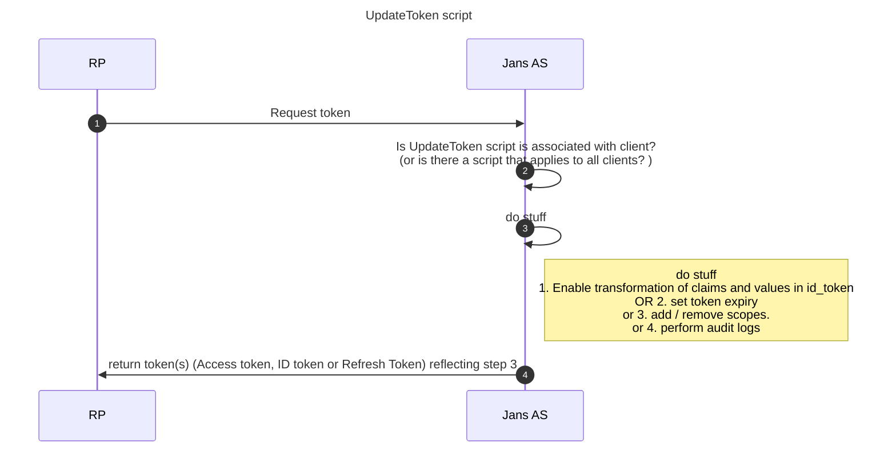

## Overview  
By overriding the interface methods in [`UpdateTokenType`](https://github.com/JanssenProject/jans/blob/main/jans-core/script/src/main/java/io/jans/model/custom/script/type/token/UpdateTokenType.java) inside a custom script you can

1. Enable transformation of claims and values in id_token and Access token e.g. add a custom claim to an `id_token`, change a token expiry, change the `sub` value, or remove the `nonce`.
   <br/>Example use-case:  
      * As per the open banking standard, the id_token should contain claim `openbanking_intent_id` and the same value should also reflect in the `sub` claim. 
      * As specified in the [FAPI Baseline Specification](https://openid.net/specs/openid-financial-api-part-1-1_0.html) the `sub` claim should have the user id. 
2. Set a specific token lifetime 
3. Perform extra business logic like adding or removing scopes.
4. Add an extra audit log for each token response.

## Flow 


## Adding the custom script to Jans server

1. Create cs.json with the contents of a CUSTOM script. To do that, run the following command.
```
/opt/jans/jans-cli/config-cli.py --schema CustomScript > /tmp/cs.json
```
2. Edit the file's contents to reflect the addition of the UpdateToken custom script.

 *  Set enabled flag `true`
 *  Configure any parameters that the script may use.
 *  `name` field should reflect the use case
 *  `script_type` should be `UPDATE_TOKEN`
 *  `script.py` can have contents similar to [Sample Script](https://github.com/JanssenProject/jans/blob/main/docs/script-catalog/update_token/sample-script/sample_script.py)) and is present in jans-cli's host machine.

```

{
  "dn": null,
  "inum": null,
  "name": "update_token",
  "aliases": [],
  "description": "Update token custom script",
  "script": "_file /root/script.py",
  "scriptType": "UPDATE_TOKEN",
  "programmingLanguage": "JYTHON",
  "moduleProperties": {
    "value1": null,
    "value2": null,
    "description": null
  },
  "configurationProperties": 

[
{
  	"value1": "param_name",
  	"value2": "DI3ICTTJKLL8PPPNGH7YI",
  	"description": "This is just an example",
  	"hide": true
  },
  {
  	"value1": "param_name_2",
  	"value2": "eEbJdi3hg42zxyFYbHArU5RuioPP",
  	"description": "yet another example",
  	"hide": true
  }
]
,
  "level": "integer",
  "revision": 0,
  "enabled": true,
  "scriptError": {
    "raisedAt": null,
    "stackTrace": null
  },
  "modified": false,
  "internal": false
}
```
 - Add the custom script. Save the response, it will contain the inum of the newly added script.
```
/opt/jans/jans-cli/config-cli.py --operation-id post-config-scripts --data /tmp/cs.json
```
## Associate an Update Token script to a client (RP) [optional step]
📝 Note: If the Update token script is not associated with a client, then it will be applicable to all clients registered in the Jans Server. Which implies that all tokens obtained using the Jans server will reflect modifications as per the script.
<br/>
To Associate an Update Token script to a client (RP), execute the command below with appropriate values for:
 - inum of the client 
 - inum of the update_token script

 ```
 /opt/jans/jans-cli/config-cli.py --operation-id patch-oauth-openid-clients-by-inum --url-suffix inum:inum_of_client
  --data '[
     {
	"op": "add",
	"path": "updateTokenScriptDns",
	"value":  ["inum={SCRIPT_ID},ou=scripts,o=jans"]
     }
     ]' 
```


## Writing an Update token script (Pseudo code for potential usecases)

### 1. Mandatory methods:
```
class UpdateToken(UpdateTokenType):

    def __init__(self, currentTimeMillis):
        self.currentTimeMillis = currentTimeMillis

    def init(self, customScript, configurationAttributes):
        return True

    def destroy(self, configurationAttributes):
        return True

    def getApiVersion(self):
        return 11
````
### 2. modifyIdToken () : Used to modify claims in an ID token 

Pseudocode and example : 
```
    # Returns boolean, true - indicates that script applied changes 
    # jsonWebResponse - is JwtHeader, you can use any method to manipulate JWT
    # context is reference of io.jans.oxauth.service.external.context.ExternalUpdateTokenContext 
    def modifyIdToken(self, jsonWebResponse, context):
              
        # header claims
	jsonWebResponse.getHeader().setClaim("header_name", "header_value")
			
	#custom claims
	jsonWebResponse.getClaims().setClaim("openbanking_intent_id", openbanking_intent_id_value)
			
	#regular claims        
	jsonWebResponse.getClaims().setClaim("sub", claimValue)

	return True
	
```


### 3.  modifyAccessToken():  
#### a. Granularity of access control:
An UpdateTokenType script is great for adding scopes or removing scopes to/from the Access token. By doing so you can tailor build the granularity of access control according to business need.

[`context.overwriteAccessTokenScopes`](https://github.com/JanssenProject/jans/blob/main/jans-auth-server/server/src/main/java/io/jans/as/server/service/external/context/ExternalUpdateTokenContext.java) is ready to use method of the `context` variable

```
    def modifyAccessToken(self, accessToken, context):
              context.overwriteAccessTokenScopes(accessToken, Sets.newHashSet("openid", "mynewscope"))
```
#### b.  Perform business check before returning AT

Pseudo code and example - Issue Access token only if account balance is greater than 0
```
    # Returns boolean, true - indicates that script applied changes 
    # accessToken - is JwtHeader, you can use any method to manipulate JWT
    # context is reference of io.jans.oxauth.service.external.context.ExternalUpdateTokenContext 
    def modifyAccessToken(self, accessToken, context):
              
         #read from session 
	sessionIdService = CdiUtil.bean(SessionIdService)
	sessionId = sessionIdService.getSessionByDn(context.getGrant().getSessionDn()) # fetch from persistence

        org_id = sessionId.getSessionAttributes().get("org_id")
	balance = thirdPartyApi.checkBalance(org_id)

        if balance > 0 :
           return True
        else:
           return False # forbid the creation of AT
```
#### c. Modify claims in an access token:
```
    # Returns boolean, true - indicates that script applied changes. If false is returned token will not be created.
    # accessToken is reference of io.jans.as.server.model.common.AccessToken (note authorization grant can be taken as context.getGrant())
    # context is reference of io.jans.oxauth.service.external.context.ExternalUpdateTokenContext 
    def modifyAccessToken(self, accessToken, context):
              
	    # header claims
	    accessToken.getHeader().setClaim("header_name", "header_value")
			
	    #custom claims
	    accessToken.getClaims().setClaim("claim_name", "claimValue")
			
	    #regular claims        
	    accessToken.getClaims().setClaim("sub", claimValue)

	    return True
	
```

### 5. Modify a specific token lifetime based on the context:
1. Refresh token lifetime:
```
    def getRefreshTokenLifetimeInSeconds(self, context):
        return 24 * 60 * 60 # one day
```
2. ID token lifetime:
```
    def getIdTokenLifetimeInSeconds(self, context):
        return 10 * 60 * 60 # 10 hours
```
3. Access token lifetime:
```
    def getAccessTokenLifetimeInSeconds(self, context):
        return 10 * 60 * 60 # 10 hours
```

### 6. modifyRefreshToken() :  
Used to modify claims in a Refresh Token
```
    # Returns boolean, true - indicates that script applied changes. If false is returned token will not be created.
    # refreshToken is reference of io.jans.as.server.model.common.RefreshToken (note authorization grant can be taken as context.getGrant())
    # context is reference of io.jans.as.server.service.external.context.ExternalUpdateTokenContext (in https://github.com/JanssenProject/jans-auth-server project, )
    def modifyRefreshToken(self, refreshToken, context):
        return True

```
## IntrospectionType script vs UpdateTokenType script 

|   | [`IntrospectionType`](https://github.com/JanssenProject/jans/blob/main/jans-core/script/src/main/java/io/jans/model/custom/script/type/introspection/IntrospectionType.java)| [`UpdateTokenType`](https://github.com/JanssenProject/jans/blob/main/jans-core/script/src/main/java/io/jans/model/custom/script/type/token/UpdateTokenType.java) |
|---|---|---|
| Client configuration parameter  |Introspection script is invoked only when **`accessTokenAsJwt`=`true`**   | Update token script is invoked irrespective of whether `accessTokenAsJwt` is `true` or `false`   |
| Core Purpose	 | Used to return access token meta information like current validity, approved scopes, and information about the context in which the token was issued when a Resource Server which queries the [Introspection endpoint](https://datatracker.ietf.org/doc/html/rfc7662)     | used to enable transformation of claims and values in id_token and Access token, set a specific token lifetime, change granularity of access control (up-scoping, down-scoping), audit logging for each token response, forbid the creation of AT based on a criteria. |
| Functionality	 | 1. Can be used to modify claims of an Access token as JWT, however this it is recommended to use UpdateToken script instead.	 |1. Used to modify id_token, refresh token and access token   |
|  |2. Introspection script cannot change scope of AT   | 2. UpdateToken can change scope of AT and modify AT object in persistence irrespective of the value of `accessTokenAsJwt` as `true` or `false` |
| Script Invocation sequence |2. **After** an Access token is generated   | 2. **Before** the creation of AT, id_token and refresh_token  |

## Testing

1. Use this: [Reference for testing](https://github.com/JanssenProject/jans/blob/main/jans-auth-server/client/src/test/java/io/jans/as/client/ws/rs/AuthorizationCodeFlowHttpTest.java)
2. Inspect the tokens. Use [jwt.io](https://jwt.io) to inspect the contents of a JWT. 

## FAQ

1. How can I add a `dict` type object as a claim value?
```
from io.jans.as.model.uti import JwtUtil
from org.json import JSONObject;

    def modifyIdToken(self, jsonWebResponse, context):
        datas =  {'country': 'ID', 'sponsor': '7022952467', 'role': 'BusinessOwner', 'salesplanaff': '220', 'acctsubtype': 'BusinessOwner', 'accttype': 'AmBCBusiness', 'abo': '7022953754', 'aboname': 'NEW', 'lclpartyid': '119700175', 'email': None, 'status': 'Active'}
        string_rep = json.dumps(datas)
        jsonObject = JwtUtil.fromJson(string_rep)
        jsonWebResponse.getClaims().setClaim("test", jsonObject)
        print "Update token script. Modify idToken: %s" % jsonWebResponse
        return True
```

