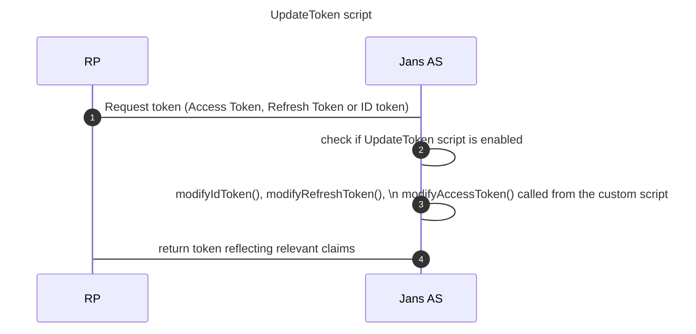

 By overriding the interface methods in [`UpdateTokenType`](https://github.com/JanssenProject/jans/blob/main/jans-core/script/src/main/java/io/jans/model/custom/script/type/token/UpdateTokenType.java) inside a custom script you can

 1. Add a custom claim to an Access Token, Refresh Token or ID token
 <br/>Example use-case:  As per the open banking standard, the access token should contain claim `openbanking_intent_id` and the same value should also reflect in the `sub` claim. 
    
 2. Modify values of Registered (header claims), public or private claims.
 <br/>Example use-case: An expectation required to be fulfilled by the FAPI-RW standard where the `sub` claim should have the user id. 

 3. Tweak the functionality of the AS to return a token only if a condition (check) is fulfilled. 
 <br/>Example use-case: Return an Access Token only if organization's account balance is greater than x.

## Flow 


## Pre-requisites
- A Janssen Authorization Server installation
- [Update Token script](https://github.com/JanssenProject/jans-setup/blob/openbank/static/extension/update_token/UpdateToken.py) - this is just an example that is present in Janssen's OpenBanking distribution


## Adding the custom script to Jans server

1. Create cs.json with the contents of a CUSTOM script. To do that, run the following command.
```
/opt/jans/jans-cli/config-cli.py --schema /components/schemas/CustomScript > /tmp/cs.json
```
2. Edit the file's contents to reflect the addition of the UpdateToken custom script.

 *  Set enabled flag `true`
 *  Configure any parameters that the script may use.
 *  `name` field should reflect the use case
 *  `script_type` should be `UPDATE_TOKEN`
 *  `script.py` can have contents similar to [Sample Script](https://github.com/JanssenProject/jans-setup/blob/openbank/static/extension/update_token/UpdateToken.py)

```

{
  "dn": null,
  "inum": null,
  "name": "update_token",
  "aliases": [],
  "description": "Update token custom script",
  "script": "_file /root/script.py",
  "scriptType": "UPDATE_TOKEN",
  "programmingLanguage": "JYTHON",
  "moduleProperties": {
    "value1": null,
    "value2": null,
    "description": null
  },
  "configurationProperties": 

[
{
  	"value1": "param_name",
  	"value2": "DI3ICTTJKLL8PPPNGH7YI",
  	"description": "This is just an example",
  	"hide": true
  },
  {
  	"value1": "param_name_2",
  	"value2": "eEbJdi3hg42zxyFYbHArU5RuioPP",
  	"description": "yet another example",
  	"hide": true
  }
]
,
  "level": "integer",
  "revision": 0,
  "enabled": true,
  "scriptError": {
    "raisedAt": null,
    "stackTrace": null
  },
  "modified": false,
  "internal": false
}
```
3. Add the custom script. Save the response, it will contain the inum of the newly added script.
```
/opt/jans/jans-cli/config-cli.py --operation-id post-config-scripts --data /tmp/cs.json
```

## How to write the custom script

### 1. Mandatory methods:
```
class UpdateToken(UpdateTokenType):

    def __init__(self, currentTimeMillis):
        self.currentTimeMillis = currentTimeMillis

    def init(self, customScript, configurationAttributes):
        return True

    def destroy(self, configurationAttributes):
        return True

    def getApiVersion(self):
        return 11
````
### 2. modifyIdToken () : Used to modify claims in an ID token 

Pseudocode and example : 
```
    # Returns boolean, true - indicates that script applied changes 
    # jsonWebResponse - is JwtHeader, you can use any method to manipulate JWT
    # context is reference of io.jans.oxauth.service.external.context.ExternalUpdateTokenContext 
    def modifyIdToken(self, jsonWebResponse, context):
              
        # header claims
	jsonWebResponse.getHeader().setClaim("header_name", "header_value")
			
	#custom claims
	jsonWebResponse.getClaims().setClaim("openbanking_intent_id", openbanking_intent_id_value)
			
	#regular claims        
	jsonWebResponse.getClaims().setClaim("sub", claimValue)

	return True
	
```
### 3.  modifyRefreshToken() :  Used to modify claims in a Refresh Token

### 4.  modifyAccessToken():  Used to modify claims in a Access Token

Pseudo code and example - Issue Access token only if account balance is greater than 0
```
    # Returns boolean, true - indicates that script applied changes 
    # jsonWebResponse - is JwtHeader, you can use any method to manipulate JWT
    # context is reference of io.jans.oxauth.service.external.context.ExternalUpdateTokenContext 
    def modifyAccessToken(self, jsonWebResponse, context):
              
         #read from session 
	sessionIdService = CdiUtil.bean(SessionIdService)
	sessionId = sessionIdService.getSessionByDn(context.getGrant().getSessionDn()) # fetch from persistence

        org_id = sessionId.getSessionAttributes().get("org_id")
	balance = thirdPartyApi.checkBalance(org_id)

        if balance > 0 :
           return True
        else:
           return False # in this case an AT will not be issued
	
```

## Associate an Update Token script to a client
Until this section of the document, we have going by the assumption that the UpdateToken script will apply to requests from all RPs (clients) registered with Janssen's Authentication server.
However, in a real scenario, you may want to modify claims, or perform checks only when specific RPs (clients ) request for tokens.


To associate the script with a client execute the command below with appropriate values for
1. inum of the client 
2. inum of the update_token script

 ```
 /opt/jans/jans-cli/config-cli.py --operation-id patch-oauth-openid-clients-by-inum --url-suffix inum:inum_of_client
  --data '[
     {
	"op": "add",
	"path": "updateTokenScriptDns",
	"value":  ["inum={SCRIPT_ID},ou=scripts,o=jans"]
     }
     ]' 
```

