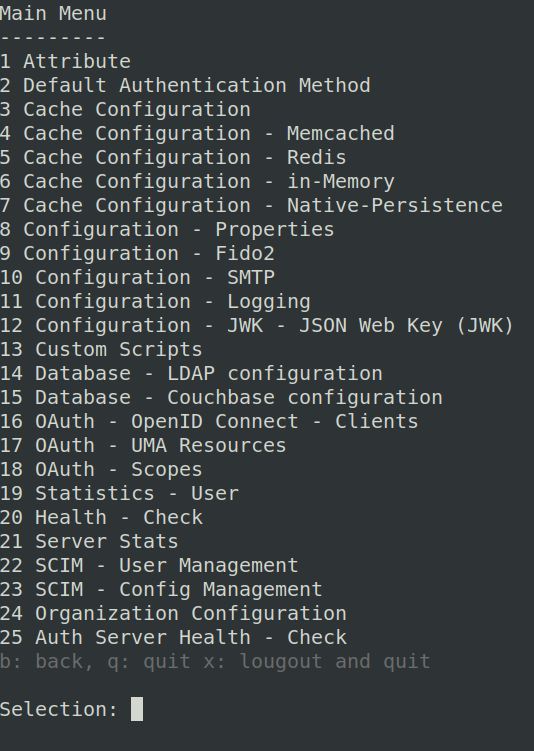

## Contents:

- [Overview](#overview)
- [Component Setup](#component-setup)
- [Configure Janssen server](#configure-janssen-server)
- [Configure Protected Resource](#configure-protected-resource)
- [Configure mod-auth-openidc](#configure-mod-auth-openidc)
- [Test Complete Flow](#test-complete-flow)

## Overview

This guide describes steps to enable authentication for web applications using Janssen server which is an OpenID Connect Provider (OP). 

Majority of the web applications use a reverse proxy, like Apache, to avail functionalities like load-balancing etc. We will configure  [mod_auth_openidc](https://github.com/zmartzone/mod_auth_openidc) Apache server module to add Relying Party(RP) functionality to existing Apache reverse proxy. RP implements authentication flows from OpenID Connect specification. For each incoming request, RP ensures that the request is authenticated. If request is not pre-authenticated, then RP will coordinate with Janssen server to integrate authentication.

#### Hardware configuration

For development and POC purposes, 4GB RAM and 10 GB HDD should be available for Janssen Server. For PROD deployments, please refer [installation guide](https://github.com/JanssenProject/jans/wiki#janssen-installation).
  

#### Prerequisites
- Installed Apache reverse proxy that is SSL enabled
- Installed Janssen server. Refer to [Janssen Installation Guide](https://github.com/JanssenProject/jans/wiki#janssen-installation) for instructions.

## Component Setup


In this setup, we have four important components.
- **Protected resource** is the resources that we need to protect using authentication. In production setups, the protected resources are usually hosted on separate server that can only be accessed via proxy. For simplicity, we will also assume that resources that need to be protected via authentication are hosted on Apache reverse proxy itself and can be accessed through `https://test.apache.rp.io/protected`.
- **User workstation** is from where the user will use browser(i.e user agent) to access the protected resource
- **Apache reverse proxy** with `mod_auth_openidc`. Together they work as `relying party (RP)` or OpenID Connect client. We will assume that this host is accessible at FQDN `https://test.apache.rp.io/`
- **Janssen server** is our open-id connect provider (OP). We will assume that Janssen server is accessible at FQDN `https://janssen.op.io/`
 

## Configure Janssen server

In this section, we will register a new OpenID Connect client on Janssen server. In our setup, the relying party (Apache with mod_auth-openidc) is the OIDC client. There are two ways you can register OIDC client with Janssen server.
1. Manual Client Registration
2. Dynamic Client Registration (DCR)

Here we will use manual client registration.

To register a new OpenID connect client on Janssen server, we will used `jans-cli` tool provided by Janssen server. `jans-cli` has menu-driven interface that makes it easy to configure Janssen server. Here we will use menu-driven approach to register a new client. To further understand how to use menu-driven approach and get complete list of supported command-line operations, refer to [jans-cli documentation](../using-jans-cli#command-line-interface).

  - Run command below to enter interactive mode.


     > Note: </br> `jans-cli` has to be authenticated and authorized with respective Janssen server. If `jans-cli` is being executed for the first time or if there is no valid access token available, then running the command below will initiate device authentication and authorization flow. In that case, follow the steps for [jans-cli authorization](../using-jans-cli/cli-tips.md#cli-authorization) to continue running the command.
  
    ```
    /opt/jans/jans-cli/config-cli.py
    ```


    Running above command will bring up interactive mode main menu. Sample below:
    
    
    
    For our purpose of registering a new OpenID Connect client, select option which is available at `16` in above sample. Selecting appropriate option will bring up related sub-menu. 

   
  - From sub-menu, select option for `Create new OpenId connect client`. Upon selecting this option, CLI will prompt for inputs which will help describe the new OpenID connect client.
  - Provide inputs for following properties:
  
    ```
    displayName: <name-of-choice>
    application Type: web
    includeClaimsInIdToken  [false]: 
    Populate optional fields? y
    clientSecret: <secret-of-your-choice>
    subjectType: public
    tokenEndpointAuthMethod: client_secret_basic
    redirectUris: https://test.apache.rp.io/callback
    scopes: email_,openid_,profile
    responseTypes: code
    grantTypes: authorization_code
    ```
    
   - Once values for all above properties are provided, input `c` in selection to instruct jans-cli to create schema using inputs provided till now. At this time, jans-cli will show the schema(JSON) which will be used to create new OpenID Connect client on Janssen server. Verify that schema has captured all the provided inputs correctly.
   - Now next step is for `jans-cli` to post this JSON schema to Janssen server to actually register new client. To do this, input `y` on the prompt.
   - If client is successfully registered then we will receive JSON data back which describes newly registered client. Complete with `inum` and `clientSecret` for new client. Few of these values (like `inum`) will be required when we configure `mod_auth_openidc` as client so keep this reponse handy. See a sample of the JSON response below:
   

      ```
      {
        "dn": "inum=165bdf95-f15e-44f0-bdd7-cdac71fda8e0,ou=clients,o=jans",
        "inum": "165bdf95-f15e-44f0-bdd7-cdac71fda8e0",
        "displayName": "dm",
        "clientSecret": "a9894ba8-eb01-4a26-a69d-026f10a49272",
        "frontChannelLogoutUri": null,
        "frontChannelLogoutSessionRequired": false,
        "registrationAccessToken": null,
        "clientIdIssuedAt": null,
        "clientSecretExpiresAt": null,
        "redirectUris": null,
        "claimRedirectUris": null,
        "responseTypes": null,
        "grantTypes": [],
        "applicationType": "web",
        "contacts": null,
        "clientName": "dm",
        "idTokenTokenBindingCnf": null,
        "logoUri": null,
        "clientUri": null,
        "policyUri": null,
        "tosUri": null,
        "jwksUri": null,
        "jwks": null,
        "sectorIdentifierUri": null,
        "subjectType": "public",
        "idTokenSignedResponseAlg": null,
        "idTokenEncryptedResponseAlg": null,
        "idTokenEncryptedResponseEnc": null,
        "userInfoSignedResponseAlg": null,
        "userInfoEncryptedResponseAlg": null,
        "userInfoEncryptedResponseEnc": null,
        "requestObjectSigningAlg": null,
        "requestObjectEncryptionAlg": null,
        "requestObjectEncryptionEnc": null,
        "tokenEndpointAuthMethod": null,
        "tokenEndpointAuthSigningAlg": null,
        "defaultMaxAge": null,
        "requireAuthTime": false,
        "defaultAcrValues": null,
        "initiateLoginUri": null,
        "postLogoutRedirectUris": null,
        "requestUris": null,
        "scopes": null,
        "claims": null,
        "trustedClient": false,
        "lastAccessTime": null,
        "lastLogonTime": null,
        "persistClientAuthorizations": false,
        "includeClaimsInIdToken": false,
        "refreshTokenLifetime": null,
        "accessTokenLifetime": null,
        "customAttributes": [],
        "customObjectClasses": null,
        "rptAsJwt": false,
        "accessTokenAsJwt": false,
        "accessTokenSigningAlg": null,
        "disabled": false,
        "authorizedOrigins": null,
        "softwareId": null,
        "softwareVersion": null,
        "softwareStatement": null,
        "attributes": {
          "tlsClientAuthSubjectDn": null,
          "runIntrospectionScriptBeforeAccessTokenAsJwtCreationAndIncludeClaims": false,
          "keepClientAuthorizationAfterExpiration": false,
          "allowSpontaneousScopes": false,
          "spontaneousScopes": null,
          "spontaneousScopeScriptDns": null,
          "backchannelLogoutUri": null,
          "backchannelLogoutSessionRequired": false,
          "additionalAudience": null,
          "postAuthnScripts": null,
          "consentGatheringScripts": null,
          "introspectionScripts": null,
          "rptClaimsScripts": null
        },
        "backchannelTokenDeliveryMode": null,
        "backchannelClientNotificationEndpoint": null,
        "backchannelAuthenticationRequestSigningAlg": null,
        "backchannelUserCodeParameter": null,
        "expirationDate": null,
        "deletable": false,
        "jansId": null
      }
      ```

## Configure protected resource

As mentioned under [component setup](#component-setup), our protected resource will be hosted on Apache reverse proxy itself. It is a simple Python based cgi script that will print request header information. and can be accessed through `https://test.apache.rp.io/cgi-bin/printHeaders.py`. Use steps below on Apache host to set up protected resource:

1. Create script file `printHeaders.py`
    ```
    vi /usr/lib/cgi-bin/printHeaders.py
    ```
    with content as below
    ```
    #!/usr/bin/python3

    import os

    d = os.environ
    k = d.keys()

    print "Content-type: text/html\n\n"

    print "<HTML><HEAD><TITLE>printHeaders.cgi</TITLE></Head><BODY>"
    print "<h1>Environment Variables</H1>"
    for item in k:
      print "<p><B>%s</B>: %s </p>" % (item, d[item])
    print "</BODY></HTML>"
    ```
 3. Add Apache `cgi` module to enable execution of CGI
    ```
    a2enmod cgi
    ```
 4. Change permissions for CGI script so that it can be executed by Apache
    ```
    chown www-data:www-data /usr/lib/cgi-bin/printHeaders.py
    chmod ug+x /usr/lib/cgi-bin/printHeaders.py
    ```
    
/var/www/protected/
## Configure *mod-auth-openidc* 

#### Install *mod-auth-openidc* 

On Apache reverse proxy host, add mod-auth-openidc using commands below
```
apt-get install libapache2-mod-auth-openidc
a2enmod auth_openidc
service apache2 restart
```
#### Configure *mod-auth-openidc* 
- Open `/etc/apache2/sites-available/default-ssl.conf`
- Add *mod-auth-openidc* configuration parameters given below for virtual host `_default_:443`. Find more configuration options for mod-auth-openidc [here](https://github.com/zmartzone/mod_auth_openidc/blob/master/auth_openidc.conf). 
- This configuration will enable authentication for any resource under `/` context root.

```
OIDCProviderMetadataURL https://janssen.op.io/jans-auth/.well-known/openid-configuration
OIDCClientID <inum-as-received-in-client-registration-response>
OIDCClientSecret <as-provided-in-client-registration-request>
OIDCResponseType code
OIDCProviderTokenEndpointAuth client_secret_basic
OIDCSSLValidateServer Off
OIDCProviderIssuer https://janssen.op.io
OIDCRedirectURI https://test.apache.rp.io/callback
OIDCCryptoPassphrase <crypto-passphrase-of-choice>
<Location "/">
    Require valid-user
    AuthType openid-connect
</Location>
```

Restart Apache service


## Test Complete Flow

- Accessing `https://test.apache.rp.io/` should redirect to Janssen authentication screen.
