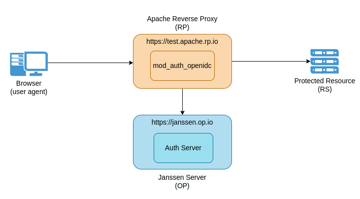

## Contents:

- [Overview](#overview)
- [Setup Janssen server](#setup-janssen-server)
- [Setup mod-auth-openidc](#setup-mod-auth-openidc)
- [Test Complete Flow](#test-complete-flow)

## Overview

This guide describes steps to enable authentication for web applications using Janssen server which is an OpenID Connect Provider (OP). 

Majority of the web applications use a reverse proxy, like Apache, to avail functionalities like load-balancing etc. We will configure  [mod_auth_openidc](https://github.com/zmartzone/mod_auth_openidc) Apache server module to add Relying Party(RP) functionality to existing Apache reverse proxy. RP implements authentication flows from OpenID Connect specification. For each incoming request, RP ensures that the request is authenticated. If request is not pre-authenticated, then RP will coordinate with Janssen server to integrate authentication.

#### Hardware configuration

For development and POC purposes, 4GB RAM and 10 GB HDD should be available for Janssen Server. For PROD deployments, please refer [installation guide](https://github.com/JanssenProject/jans/wiki#janssen-installation).
  

#### Prerequisites
- Installed Apache reverse proxy that is SSL enabled
- Installed Janssen server. Refer to [Janssen Installation Guide](https://github.com/JanssenProject/jans/wiki#janssen-installation) for instructions.

## Component Setup



In this setup, we have four important components.
- **User workstation**. From workstation, user will use browser(i.e user agent) to access protected resource. 
- **Apache reverse proxy** with `mod_auth_openidc`. Together they work as `relying party (RP)`. We will assume that this host accessible with FQDN `https://test.apache.rp.io/`.
- **Janssen server**, which is our open-id connect provider (OP). We will assume that Janssen server is accessible at FQDN `https://janssen.op.io/`
- **Protected resource**. These are resources that we need to protect using authentication. For simplicity, we will also assume that resources that need to be protected via authentication are hosted on same server. In production setups protected resources are usually hosted on separate server that can only be accessed via proxy.

#### Configure Janssen server

Janssen server provides `jans-cli` CLI tool to configure Janssen server. `jans-cli` has menu-driven interface that makes it easy to configure Janssen server. Here we will use menu-driven approach as well as command-line operations to configure Janssen server. To further understand how to use menu-driven approach and get complete list of supported command-line operations, refer to [jans-cli documentation](../using-jans-cli#command-line-interface).

Use steps below to configure Janssen server.

- Manually register client(RP) as OpenID Connect client
  - Run command below on host running Janssen Server
  
    ```
    /opt/jans/jans-cli/config-cli.py
    ```
   
  - Navigate through options to start registering new OpenID Connect client
  - Provide inputs for following properties:
  
    ```
    displayName: <name-of-choice>
    applicationType: web
    includeClaimsInIdToken  [false]: _true
    Populate optional fields? y
    clientSecret: <secret-of-your-choice>
    subjectType: public
    tokenEndpointAuthMethod: client_secret_basic
    redirectUris: https://test.apache.rp.io/redirect
    scopes: email openid profile
    responseTypes: code
    grantTypes: authorization_code
    ```
    
   - Copy the resulting JSON data and save it to a file, say `register-apache-rp.json`.
   - Use `jans-cli` operations to register the client using the command below
   
     > Note: </br> In order to run operations, the `jans-cli` has to be authenticated and authorized with respective Janssen server. If `jans-cli` operation is being executed for the first time or if there is no valid access token available, then running the command below will initiate authentication and authorization flow. In that case, follow the steps for [jans-cli authorization](../using-jans-cli/cli-tips.md#cli-authorization) to continue running the command.
   
     ```
     /opt/jans/jans-cli/config-cli.py --operation-id post-oauth-openid-clients --data <path>/register-apache-rp.json
     ```
     
   - Output of this command would be a JSON response. Save this response to a file as some of the values in it will be required when configuring *mod-auth-openidc*.
 

## Setup *mod-auth-openidc* 

#### Install *mod-auth-openidc* 

On Apache reverse proxy host, add mod-auth-openidc using commands below
```
sudo apt-get install libapache2-mod-auth-openidc
sudo a2enmod auth_openidc
service apache2 restart
```
#### Configure *mod-auth-openidc* 
- Open `/etc/apache2/sites-available/default-ssl.conf`
- Add *mod-auth-openidc* configuration parameters given below for virtual host `_default_:443`. Find more configuration options for mod-auth-openidc [here](https://github.com/zmartzone/mod_auth_openidc/blob/master/auth_openidc.conf). 
- This configuration will enable authentication for any resource under `/` context root.

```
OIDCProviderMetadataURL https://janssen.op.io/jans-auth/.well-known/openid-configuration
OIDCClientID <inum-as-received-in-client-registration-response>
OIDCClientSecret <as-provided-in-client-registration-request>
OIDCResponseType code
OIDCProviderTokenEndpointAuth client_secret_basic
OIDCSSLValidateServer Off
OIDCProviderIssuer https://janssen.op.io
OIDCRedirectURI https://test.apache.rp.io/redirect
OIDCCryptoPassphrase <crypto-passphrase-of-choice>
<Location "/">
    Require valid-user
    AuthType openid-connect
</Location>
```

Restart Apache service


## Test Complete Flow

- Accessing `https://test.apache.rp.io/` should redirect to Janssen authentication screen. Upon successful authentication, browser should be redirected to `https://test.apache.rp.io/redirect`.
