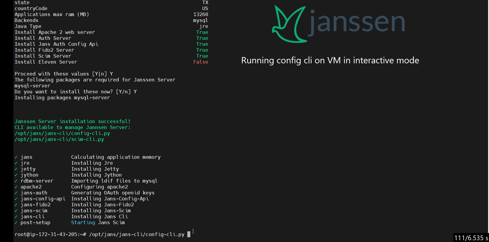

# Janssen CLI

`jans-cli` module is a command line interface for configuring the Janssen software, providing both interactive and simple single line options for configuration. This module interacts with Janssen server via RESTful configuration APIs that server exposes. Using these REST APIs, `jans-cli` allows configuration of authorization server and its major modules for FIDO2, SCIM, OpenID Connect etc. 
</br>
</br>

<p align="center">
 
</p>

`jans-cli` offers two modes in which it can be used. Command-line and interactive mode. 

- **Command-line mode**: With command-line mode you can run a single command with all the required inputs to perform the operation you want. A sample command-line may look like below:

  ```
  /opt/jans/jans-cli/config-cli.py --operation-id get-attributes --endpoint-args limit:5
  ```

- **Interactive mode**: Interactive mode is a terminal based menu-driven mode where user can select intended action from available options and also provide input parameters required for that action.

<p align="center">
  
</p>

# Documentation Index

## [Command Line Interface](cli-index.md)

* [Basic Information](cli-tips.md)
* [Attribute](cli-attribute.md)
* [Default Authentication](cli-default-authentication-method.md)
* [Cache Configuration](cli-cache-configuration.md)
* [Authorization Server Configuration](cli-jans-authorization-server.md)
* [FIDO2 Configuration](cli-janssen-fido2-configuration.md)
* [Logging Management](cli-logging-configuration.md)
* [JSON Web Key (JWK)](cli-jwk-json-web-key-jwk.md)
* [LDAP Configuration](cli-ldap-configuration.md)
* [Couchbase Configuration](cli-couchbase-configuration.md)
* [OAuth Scope Management](cli-oauthscopes.md)
* [UMA Management](cli-oauthumaresources.md)
* [OpenID Connect Client Configuration](cli-openid-connect-client-configuration.md)
* [SMTP Configuration](cli-smtp-configuration.md)
* [Custom Scripts](cli-custom-scripts.md)
* [SCIM Management](cli-scim.md)
  * [User Resources](cli-user.md)
  * [Group Management](cli-group.md)

## [Menu-Driven Interactive Mode](im/im-index.md)

* [Basic Information](im/im-tips.md)
* [Attribute](im/im-attribute.md)
* [Default Authentication Method](im/im-authentication-method.md)
* [Cache Configuration](im/im-cache-configuration.md)
* [Authorization Server Configuration](im/im-jans-authorization-server.md)
* [FIDO2 Configuration](im/im-janssen-fido2.md)
* [Logging Management](im/im-janssen-logging-configuration.md)
* [JWK Configuration](im/im-json-web-key.md)
* [LDAP Configuration](im/im-ldap-configuration.md)
* [Couchbase Configuration](im/im-couchbase-configuration.md)
* [OAuth Scope Management](im/im-oauth-scopes.md)
* [OpenID Connect Client Configuration](im/im-openid-connect-clients.md)
* [SMTP Configuration](im/im-smtp-server-configuration.md)
* [UMA Management](im/im-user-managed-access-(uma).md)
* [Custom Scripts](im/im-custom-scripts.md)
* [SCIM Management](cli-scim.md)
  * [User Resources](im/im-user.md)
  * [Group Resources](im/im-group.md)
