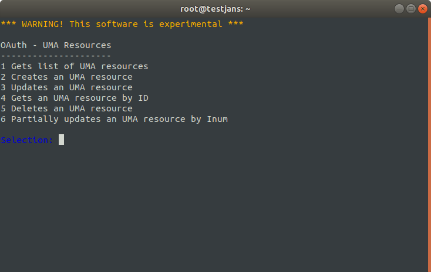

# UMA

> Prerequisite: Know how to use the Janssen CLI in [interactive mode](im-index.md)

UMA helps to manage user authorization. Using IM, you can easily maintain UMA resources. If you select `16` option on the IM Menu, you will get a list as below:

you can perform such operations:
- view/find
- create
- update / partially update
- delete

To get a list of UMA resources of your Janssen Server, you can select option 1.
It will ask `search limit[50]` by default set up to 50 and `pattern` of string.

