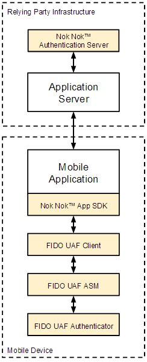
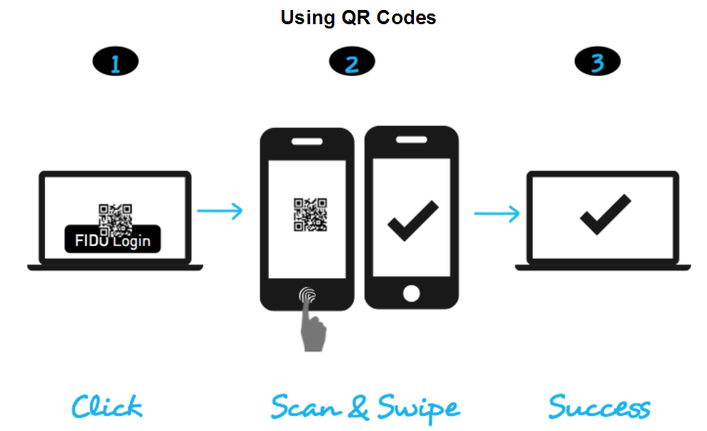
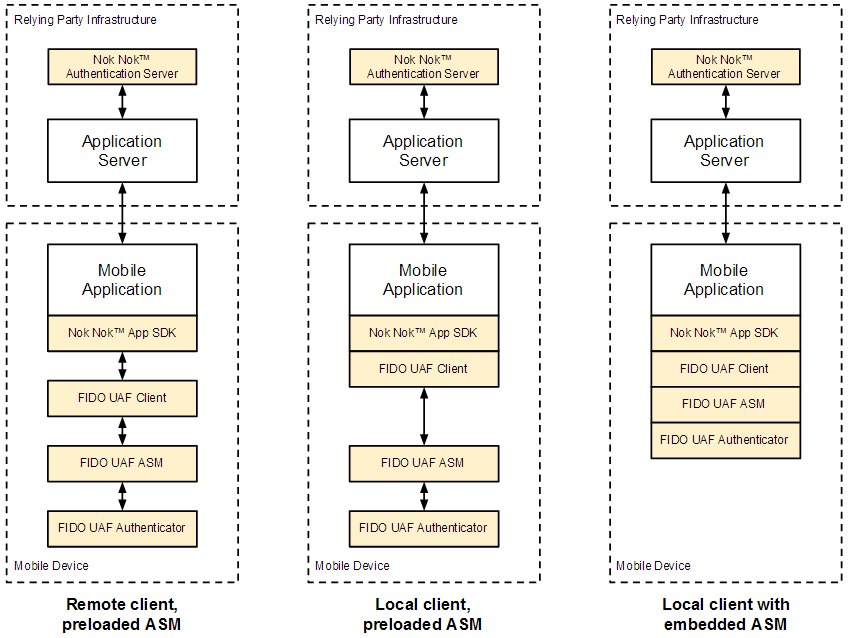
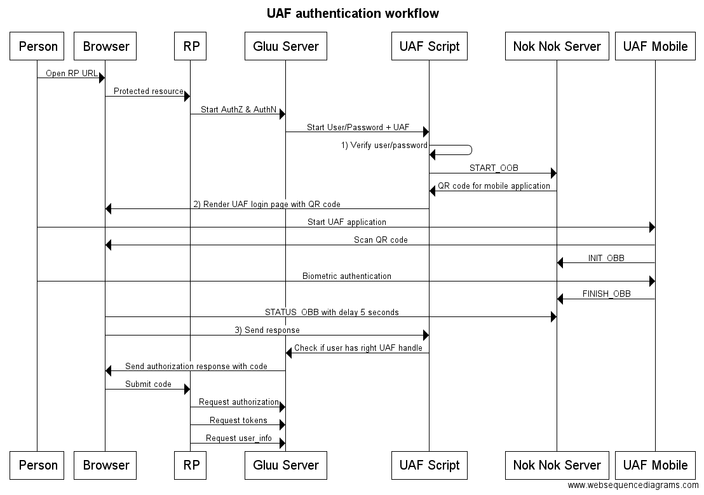

# FIDO UAF Authenticator

UAF allows applications to take advantage of the security capabilities of modern devices such as fingerprint, iris, and voice biometrics. It provides a unified infrastructure that allows you to integrate these capabilities in a simple manner to enable authentication that is both more user friendly and more secure than passwords.

## Typical UAF architecture

The following diagram provides an overview of the UAF infrastructure, which contains (1) components that resides on the user’s device, and (2) server side components that connect to a UAF server. The typical gateway between these two parts is a mobile browser with a UAF plugin. The RP should provide proxy capabilities to deliver messages from the mobile browser plugin to the UAF server.

It's not very convenient when the RP is a second device. Non Nok offers an Out-of-band (OOB) API which simplifies UAF integration in this case.   

## Out-of-Band Authentication 
Out-of-Band authentication allows mobile device authenticatation with UAF even on devices that 
do not have any UAF components installed. Using this workflow, the user of a laptop authenticates 
to a web application using their mobile device. The user binds the browser session to his or her 
mobile device by scanning a QR code, or by triggering a push notification. The user then performs 
the UAF authentication on an out-of-band channel between the mobile device and the Nok Nok 
Authentication Server. Once the user authenticates successfully, the Authentication Server 
notifies your application server. OOB is a proprietary feature developed by Nok Nok Labs on top 
of the FIDO UAF protocol. 

Also it allows push notification messages to be sent by the platform.

## Device integration models

This is not a part of the UAF authentication script, but it shows the modular
architecture of the UAF mobile authentication stack.

Some devices will feature a preloaded UAF Client and one or more UAF ASMs. In some cases, 
devices may only feature a preloaded UAF ASM, rather than both a UAF Client and ASM. Older 
legacy devices may feature neither a UAF Client nor a UAF ASM. Nevertheless the App SDK 
can support each of these three scenarios illustrated below from the same mobile application. 

## Integration with oxAuth

The oxAuth UAF integration leverages the Person Authentication module. This workflow shows
the communication process between the components.

## Person authentication module activation

This module is part of CE. It has only one mandatory property "uaf_server_uri". There are more information about module configuration in "Installation.md" and "Properties description.md"

Nok Nok SDK contains sample application which allows to test script. In the SDK there are binaries and source code of this application.
