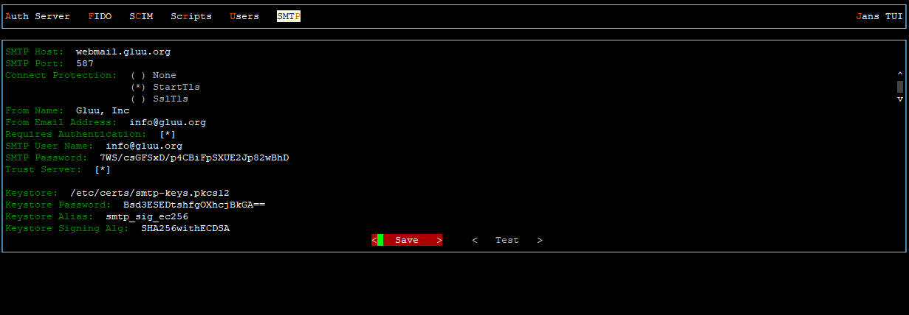
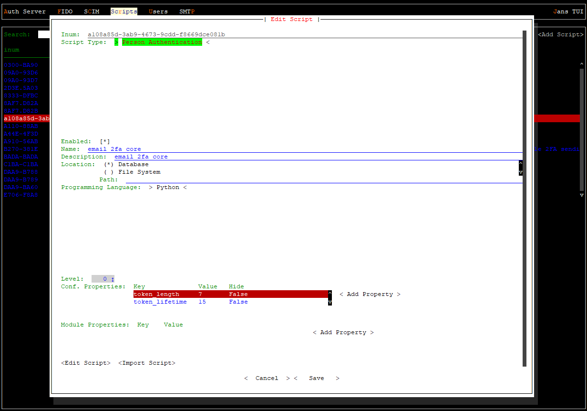
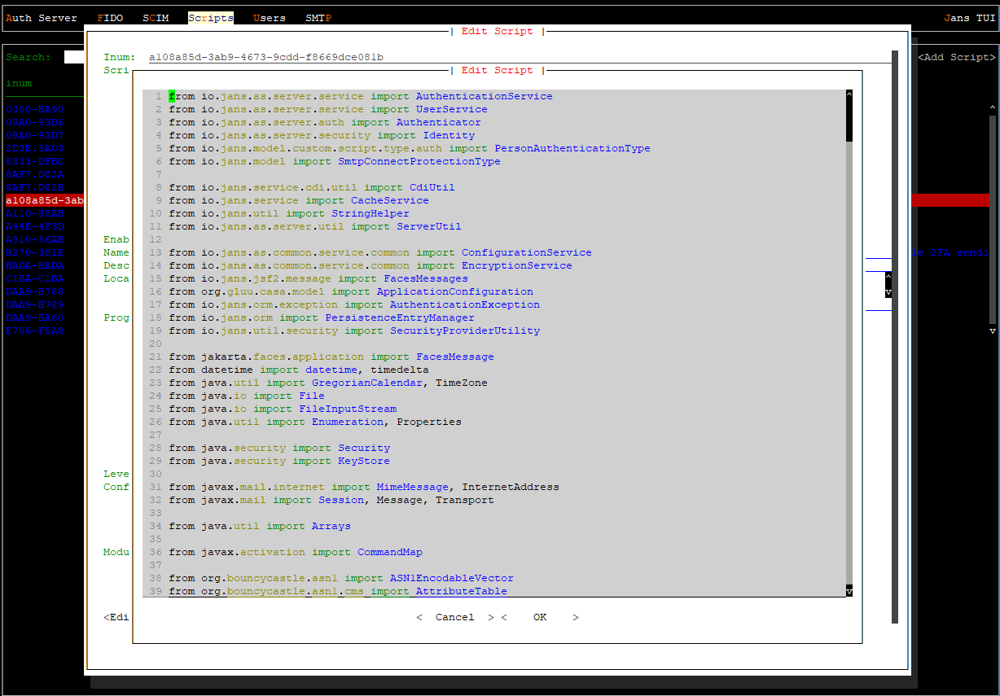

# EMail 2FA Authentication Plugin
### Plugin allows enrollment and authentication via user email address
Steps:  
- Tune **SMTP** configuration of **janssen** (for example, using **/opt/jans/jans-cli/config-cli.py** or **/opt/jans/jans-cli/config-cli-tui.py**):  
  
;
- Enable **email_2fa_core** custom script in **janssen**, parameters: **Script Type**: **Person Authentication**, example of configuration:  
  
  
;
- Log in to casa, in casa admin console, go to **Casa Plugins** and add the plugin jar file in the admin console;
- After **email_2fa_core** plugin jar file is loaded and appeared in the list of loaded plugins, go to the menu item: **Enabled authentication methods**;
- Select **email_2fa_core** as a 2fa method for authentication;
- Notice the newly created menu that has name **Email 2FA Core** in the menu bar;
- Restart **jans-auth**;
- Restart **casa**.
