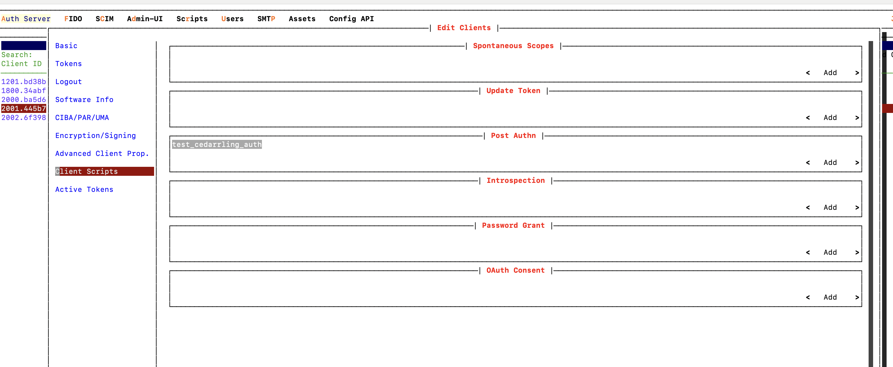

# Cedarling Java binding

This guide explores the process of generating the Kotlin binding for Cedarling using [Cedarling UniFFI](https://github.com/JanssenProject/jans/tree/main/jans-cedarling/bindings/cedarling_uniffi). The Kotlin binding is then wrapped in a Java class to enable convenient use in Java applications.

## Installation

### Building from Source

#### Prerequisites:

- Rust: Install it from [the official Rust website](https://www.rust-lang.org/tools/install).
- Java Development Kit (JDK): version 11 or higher
- Apache Maven: Install it from [Apache Maven Website](https://maven.apache.org/download.cgi)

#### Building from Kotlin binding

1. Build Cedarling by executing below command from `./jans/jans-cedarling` of cloned jans project:

```bash
cargo build -r -p cedarling_uniffi
```

In `target/release`, you should find the `libcedarling_uniffi.dylib` (if Mac OS), `libcedarling_uniffi.so` (if Linux OS), or `libcedarling_uniffi.dll` (if Windows OS) file, depending on the operating system you are using.

2. Generate the bindings for Kotlin by running the command below. Replace `{build_file}` with `libcedarling_uniffi.dylib`, `libcedarling_uniffi.so`, or `libcedarling_uniffi.dll`, depending on which file is generated in `target/release`.

```bash
cargo run --bin uniffi-bindgen generate --library ./target/release/{build_file} --language kotlin --out-dir ./bindings/cedarling-java/src/main/kotlin/io/jans/cedarling
```

3. Copy the generated `libcedarling_uniffi.dylib`, `libcedarling_uniffi.so`, or `libcedarling_uniffi.dll` file to resource directory of the `cedarling-java` Maven project. Replace `{build_file}` in the below commad with `libcedarling_uniffi.dylib`, `libcedarling_uniffi.so`, or `libcedarling_uniffi.dll`, depending on which file is generated in `target/release`.

```bash
mkdir ./bindings/cedarling-java/src/main/resources
cp ./target/release/{build_file} ./bindings/cedarling-java/src/main/resources
```

4. Change directory to `./bindings/cedarling-java` and run below command to build `cedarling-java` jar file. This will generate `cedarling-java-{version}-distribution.jar` at `./bindings/cedarling-java/target/`.

```bash
 mvn clean install
```

### Using Cedarling-java Maven dependency

To use Cedarling Java bindings in Java Maven Project add following `repository` and `dependency` in pom.xml of the project

```declarative
    <repositories>
        <repository>
            <id>jans</id>
            <name>Janssen project repository</name>
            <url>https://maven.jans.io/maven</url>
        </repository>
    </repositories>
```

```declarative
        <dependency>
            <groupId>io.jans</groupId>
            <artifactId>cedarling-java</artifactId>
            <version>{latest-jans-stable-version}</version>
        </dependency>
```

## Recipes

### Using the Cedarling Java binding in custom scripts on the Janssen Auth Server (VM installation).

**Note:** This recipe is compatible with Jans version 1.4.0 and earlier.

1. Upload [bootstrap.json](./docs/bootstrap.json), [policy-store.json](./docs/policy-store.json), [action.txt](./docs/action.txt), [context.json](./docs/context.json), [principals.json](./docs/principals.json) and [resource.json](./docs/resource.json) at `/opt/jans/jetty/jans-auth/custom/static` location of the auth server.
2. Upload the generated `cedarling-java-{version}-distribution.jar` at `/opt/jans/jetty/jans-auth/custom/libs` location of the auth server.
3. The following Post Authn script has been created for calling Cedarling authorization. Add and enable the following [Post Authn custom script](./docs/sample_cedarling_post_authn.java) (in Java) with following Custom Properties. The [Asset Screen](https://docs.jans.io/v1.6.0/janssen-server/config-guide/custom-assets-configuration/#asset-screen) can be used to upload assets.

| Key                  | Values                          |
| -------------------- | ------------------------------- |
| BOOTSTRAP_JSON_PATH  | ./custom/static/bootstrap.json  |
| ACTION_FILE_PATH     | ./custom/static/action.txt      |
| RESOURCE_FILE_PATH   | ./custom/static/resource.json   |
| CONTEXT_FILE_PATH    | ./custom/static/context.json    |
| PRINCIPALS_FILE_PATH | ./custom/static/principals.json |

4. Map the script with client used to perform authentication.



5. The script runs after client authentication to invoke Cedarling authz.

## Configuration

### Policy Store Sources

Cedarling supports multiple ways to load policy stores:

#### Legacy Single-File Formats

```json
{
  "CEDARLING_POLICY_STORE_LOCAL_FN": "/path/to/policy-store.json",
  "CEDARLING_POLICY_STORE_URI": "https://lock-server.example.com/policy-store"
}
```

#### New Directory-Based Format

Policy stores can be structured as directories with human-readable Cedar files:

```text
policy-store/
├── metadata.json           # Required: Store metadata (id, name, version)
├── manifest.json           # Optional: File checksums for integrity validation
├── schema.cedarschema      # Required: Cedar schema (human-readable)
├── policies/               # Required: .cedar policy files
│   ├── allow-read.cedar
│   └── deny-guest.cedar
├── templates/              # Optional: .cedar template files
├── entities/               # Optional: .json entity files
└── trusted-issuers/        # Optional: .json issuer configurations
```

**metadata.json structure:**

```json
{
  "cedar_version": "4.4.0",
  "policy_store": {
    "id": "abc123def456",
    "name": "My Application Policies",
    "version": "1.0.0"
  }
}
```

#### Cedar Archive (.cjar) Format

Policy stores can be packaged as `.cjar` files (ZIP archives) for easy distribution.

### ID Token Trust Mode

The `CEDARLING_ID_TOKEN_TRUST_MODE` property controls how ID tokens are validated:

- **`strict`** (default): Enforces strict validation rules
  - ID token `aud` must match access token `client_id`
  - If userinfo token is present, its `sub` must match the ID token `sub`
- **`never`**: Disables ID token validation (useful for testing)
- **`always`**: Always validates ID tokens when present
- **`ifpresent`**: Validates ID tokens only if they are provided

### Testing Configuration

For testing scenarios, you may want to disable JWT validation. You can configure this in your bootstrap configuration:

```json
{
  "CEDARLING_JWT_SIG_VALIDATION": "disabled",
  "CEDARLING_JWT_STATUS_VALIDATION": "disabled",
  "CEDARLING_ID_TOKEN_TRUST_MODE": "never"
}
```

For complete configuration documentation, see [cedarling-properties.md](../../../docs/cedarling/cedarling-properties.md).

## Context Data API

The Context Data API allows you to push external data into the Cedarling evaluation context, making it available in Cedar policies through the `context.data` namespace.

These methods are available on the underlying UniFFI-generated `Cedarling` instance returned by `getCedarling()`.
In Java/Kotlin bindings, `JsonValue` is represented as a plain `String`.

```java
import uniffi.cedarling_uniffi.*;
import org.json.JSONObject;
import java.util.List;

CedarlingAdapter adapter = new CedarlingAdapter();
adapter.loadFromJson(bootstrapJson);
Cedarling cedarling = adapter.getCedarling();

// Push data with optional TTL (in seconds)
// The TTL parameter is a nullable Long representing seconds.
// Pass null to use the default TTL from configuration, or pass a Long value for a custom TTL.
String value = "{\"role\":[\"admin\",\"editor\"],\"country\":\"US\"}";
cedarling.pushDataCtx("user:123", value, null);  // null uses default TTL
cedarling.pushDataCtx("config:app", value, 300L);  // Custom TTL: 300 seconds (5 minutes)

// Get data
String result = cedarling.getDataCtx("user:123");
if (result != null) {
    JSONObject data = new JSONObject(result);
}

// Get data entry
DataEntry entry = cedarling.getDataEntryCtx("user:123");
if (entry != null) {
    System.out.println("Key: " + entry.getKey());
    System.out.println("Data type: " + entry.getDataType());
    System.out.println("Created at: " + entry.getCreatedAt());
}

// Remove / clear / list / stats
boolean removed = cedarling.removeDataCtx("user:123");
cedarling.clearDataCtx();
List<DataEntry> entries = cedarling.listDataCtx();
DataStoreStats stats = cedarling.getStatsCtx();
```

### Using Data in Cedar Policies

Data pushed via the Context Data API is automatically available in Cedar policies under the `context.data` namespace:

```cedar
permit(
    principal,
    action == Action::"read",
    resource
) when {
    context.data["user:123"].role.contains("admin")
};
```

The data is injected into the evaluation context before policy evaluation, allowing policies to make decisions based on dynamically pushed data.

### Error Handling

The Context Data API methods throw `DataException`:

```java
try {
    cedarling.pushDataCtx("", "{\"data\":\"value\"}", null); // Empty key
} catch (DataException.DataOperationFailed e) {
    System.out.println("Data operation failed: " + e.getMessage());
}
```
