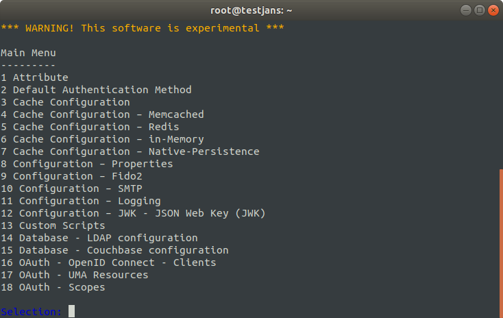
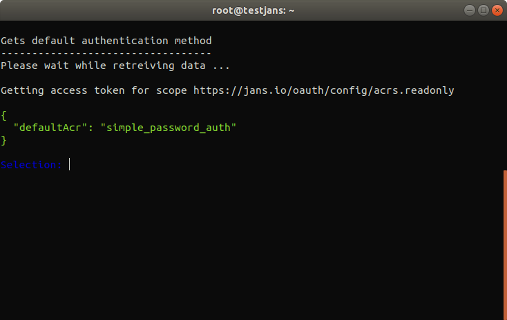

# _Janssen Command Line Interface_
`jans-cli` is a **Command Line Interface** for Janssen Configuration. It also has `menu-driven` interface that makes it easier to understand how to use [Janssen Server](https://github.com/JanssenProject/home) through the Interactive Mode.

Table of Contents
=================

   * [<em>Janssen Command Line Interface</em>](#janssen-command-line-interface)
   * [<em>Installation</em>](#installation)
   * [<em>Quick Start</em>](#quick-start)

# _Installation_

You can directly download the `jans-cli` package file as below:

### For macOs:

```
wget https://github.com/JanssenProject/jans-cli/releases/latest/download/jans-cli-macos-amd64.pyz
```

### for linux:

```
wget https://github.com/JanssenProject/jans-cli/releases/latest/download/jans-cli-linux-amd64.pyz
```

## Build `jans-cli.pyz` manually

If you would like to build `jans-cli` manually, you can go through the following steps noted here:

## Prerequisites
1. wget
1. unzip
1. Python 3.6+.
1. Python `pip3` package.

### Building 

1. Install dependencies

    ```sh
    apt install -y wget unzip python3-pip python3-dev
    pip3 install shiv
    ```

2. Download the repository:

    ```sh
    wget https://github.com/JanssenProject/jans/archive/refs/heads/main.zip
    ```

3. Unzip package, and change to directory

    ```sh
    unzip main.zip
    cd jans-main/jans-cli
    ```

4. Build

    ```sh
    make zipapp
    ```

You can verify with the following command line if everything is done successfully.

```
python3 config-cli.pyz -h
```


### Standard Python package
1. Install venv module
    ```sh
    pip3 install virtualenv
    ```

1.  Create virtual environment and activate:

    ```sh
    python3 -m virtualenv .venv
    source .venv/bin/activate
    ```

1.  Download and install the package:

    ```
    wget https://github.com/JanssenProject/jans/archive/refs/heads/main.zip
    unzip main.zip
    cd jans-main/jans-cli
    make install
    ```

    This command will install executable called `jans-cli` available in virtual environment `PATH`.


## Virtual Machine Setup

**jans-cli** is automatically installed if you choose `jans-config-api` during [Janssen Server](https://github.com/JanssenProject/home/blob/main/development.md#install-janssen-into-vm) Installation on Virtual Machine. 


After successfully installed Janssen Server, you will get two command-line arguments as below:


# _Quick Start_

As you have seen, CLI supports both of the `config-cli` and `scim-cli`. For a quick start, let's run the following command.

```
/opt/jans/jans-cli/config-cli.py
```
If you get an error, you can try in this way:

```
python3 /opt/jans/jans-cli/config-cli.py
```

Alternatively, you can make python3 to default version:
```
sudo update-alternatives --install /usr/bin/python python /usr/bin/python3 10
/opt/jans/jans-cli/config-cli.py
```

You will get a menu as below image:



From the following list, you can choose any options by selecting its number. For example, let's say number 2,
to get **Default Authentication Method**.

That returns another two options as below:


Now selecting 1 and it returns our desired result as below image:



So, That was a quick start to view how this _jans-cli_ Interactive Mode works. Please, follow this [link](../docs/admin/jans-cli) to read the _jans-cli_ docs for a better understanding of the Janssen Command-Line.

