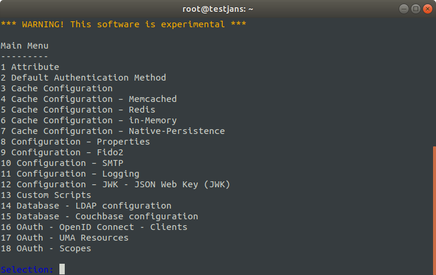

# Menu Driven Interactive Mode

We will refer _Menu-driven Interactive Mode_ as **IM**. To run IM just simply execute jans-cli as follows:
```
/opt/jans/jans-cli/config-cli.py
```

Note: You can supply certificate and key with options `--key-file` and `--cert-file`, to disable ssl verification use `-noverify`.
For more information `/opt/jans/jans-cli/config-cli.py -h`

You will see the main menu as below:



Using IM is very simple and intuitive. Just make a selection and answer questions. There is a special option to read value for a question from a file using **_file** tag. This option is the most suitable choice to input the large text (e.g., interception script source code or JSON file content). To use this option input **_file /path/of/file** e.g. **_file /home/user/interceptionscript.py**. From the following menu, you can choose an option by selecting its number. Let's start from the beginning.

