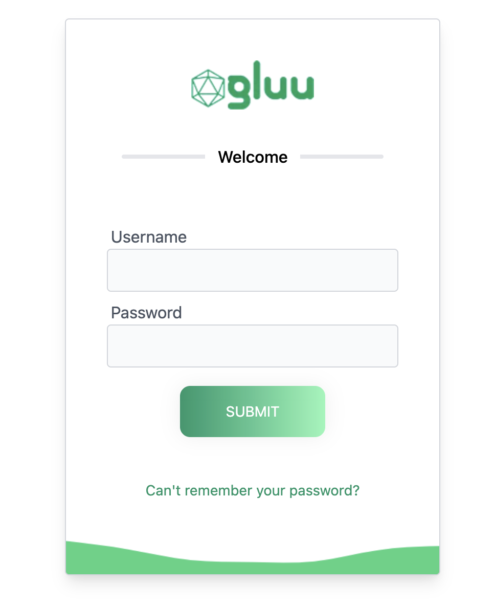

<p align="left">
  
</p>

[![Contributors][contributors-shield]](contributors-url)
[![Forks][forks-shield]](forks-url)
[![Stargazers][stars-shield]](stars-url)
[![Issues][issues-shield]](issues-url)
[![Apache License][license-shield]](license-url)


# About Agama-PW Project

This repo is home to the Gluu Agama-PW project. This Agama project provides 
standard username-password authentication for a person.



## Where To Deploy

The project can be deployed to any IAM server that runs an implementation of 
the [Agama Framework](https://docs.jans.io/head/agama/introduction/) like 
[Janssen Server](https://jans.io) and [Gluu Flex](https://gluu.org/flex/).

## How To Deploy

Different IAM servers may provide different methods and 
user interfaces from where an Agama project can be deployed on that server. 
The steps below show how the Agama-PW project can be deployed on the 
[Janssen Server](https://jans.io). 

Deployment of an Agama project involves three steps

- [Downloading the `.gama` package from project repository](#download-the-project)
- [Adding the `.gama` package to the IAM server](#add-the-project-to-the-server)
- [Configure the project](#configure-the-project)


### Download the Project

> [!TIP]
> Skip this step if you use the Janssen Server TUI tool to 
> configure this project. The TUI tool enables the download and adding of this 
> project directly from the tool, as part of the `community projects` listing. 

The project is bundled as 
[.gama package](https://docs.jans.io/head/agama/gama-format/). 
Visit the `Assets` section of the 
[Releases](https://github.com/GluuFederation/agama-pw/releases) to download 
the `.gama` package.

### Add The Project To The Server

 The Janssen Server provides multiple ways an Agama project can be 
 deployed and configured. Either use the command-line tool, REST API, or a 
 TUI (text-based UI). Refer to 
 [Agama project configuration page](https://docs.jans.io/head/admin/config-guide/auth-server-config/agama-project-configuration/) in the Janssen Server documentation for more 
 details.

### Configure The Project

The Agama project accepts configuration parameters in JSON format. Every Agama project comes with a sample configuration file for reference.

Below is a typical configuration for the Agama-PW project:

```json
{
  "org.gluu.agama.pw.main": {
    "maxLoginAttempt": 6,
    "enableLock": true,
    "lockExpTime": 180
  }
}
```

| Parameter         | Required | Description                                                                                                   | Example |
| ----------------- | -------- | ------------------------------------------------------------------------------------------------------------- | ------- |
| `maxLoginAttempt` | Yes      | Maximum number of consecutive failed login attempts allowed before the account is locked.                     | `6`     |
| `enableLock`      | Yes      | Enables or disables the account lockout feature after the maximum number of failed login attempts is reached. | `true`  |
| `lockExpTime`     | Yes      | Duration, in seconds, for which the account remains locked before it is automatically unlocked.               | `180`   |

> **Note**
>
> If `enableLock` is set to `true`, users who exceed `maxLoginAttempt` consecutive failed login attempts will be locked out for the duration specified by `lockExpTime`. If `enableLock` is set to `false`, failed login attempts will not trigger account lockout regardless of the `maxLoginAttempt` value.


### Test The Flow

Use any Relying party implementation (like [jans-tarp](https://github.com/JanssenProject/jans/tree/main/demos/jans-tarp)) to send authentication request that triggers the flow.

From the incoming authentication request, the Janssen Server reads the `ACR` 
parameter value to identify which authentication method should be used. 
To invoke the `org.gluu.agama.pw.main` flow contained in the  Agama-PW project, 
specify the ACR value as `agama_<qualified-name-of-the-top-level-flow>`, 
i.e  `agama_org.gluu.agama.pw.main`.


## Customize and Make It Your Own

Fork this repo to start customizing the Agama-PW project. It is possible to 
customize the user interface provided by the flow to suit your organization's 
branding 
guidelines. Or customize the overall flow behavior. Follow the best 
practices and steps listed 
[here](https://docs.jans.io/head/admin/developer/agama/agama-best-practices/#project-reuse-and-customizations) 
to achieve these customizations in the best possible way.
This  project can be re-used in other Agama projects to create more complex
 authentication journeys. To re-use, trigger the 
 [org.gluu.agama.pw.main](#orggluuagamapwmain) flow from other Agama projects.

To make it easier to visualize and customize the Agama Project, use 
[Agama Lab](https://cloud.gluu.org/agama-lab/login).

## Flows In The Project

List of the flows: 

- [org.gluu.agama.pw.main](#orggluuagamapwmain)

### org.gluu.agama.pw.main

[org.gluu.agama.pw.main](code/org.gluu.agama.pw.main.flow) flow represents 
single step username and password authentication. This flow allows a configurable
number of incorrect login attempts along with the ability to call account locking 
endpoint if the attempts reach the maximum allowed number.

```mermaid
sequenceDiagram
title Agama-PW Basic Flow
actor Person
participant Browser
participant website
participant IDP
participant Authenticate
 
Person->>IDP: Sign-in request
IDP->>Browser: uid/pw Form
Person->>Browser: Creds
Browser->>IDP: POST Form
IDP->>Authenticate: validate(uid, pw)
Authenticate->>IDP: {"result":"success","code": 200,"message": "OK"}
IDP->>Browser: OpenID Code
Browser->>website: callback
 ```

#### Parameter Details

- maxLoginAttempt: Is the maximum failed login attempt before the user account is locked
- enableLock: true/false, enables or disables the Account Lock feature
- lockExpTime: The time in seconds before a locked account is unlocked.


# Demo

Check out this video to see the **agama-pw** authentication flow in action.
Also check the 
[Agama Project Of The Week](https://gluu.org/agama-project-of-the-week/) video
series for a quick demo on this flow.

*Note:*
While video shows how the flow works overall, it may be dated. Do check the 
[Test The Flow](#test-the-flow) section to understand the current
method of passing the ACR parameter when invoking the flow.

<!-- This are stats url reference for this repository -->
[contributors-shield]: https://img.shields.io/github/contributors/GluuFederation/agama-pw.svg?style=for-the-badge
[contributors-url]: https://github.com/GluuFederation/agama-pw/graphs/contributors
[forks-shield]: https://img.shields.io/github/forks/GluuFederation/agama-pw.svg?style=for-the-badge
[forks-url]: https://github.com/GluuFederation/agama-pw/network/members
[stars-shield]: https://img.shields.io/github/stars/GluuFederation/agama-pw?style=for-the-badge
[stars-url]: https://github.com/GluuFederation/agama-pw/stargazers
[issues-shield]: https://img.shields.io/github/issues/GluuFederation/agama-pw.svg?style=for-the-badge
[issues-url]: https://github.com/GluuFederation/agama-pw/issues
[license-shield]: https://img.shields.io/github/license/GluuFederation/agama-pw.svg?style=for-the-badge
[license-url]: https://github.com/GluuFederation/agama-pw/blob/main/LICENSE
