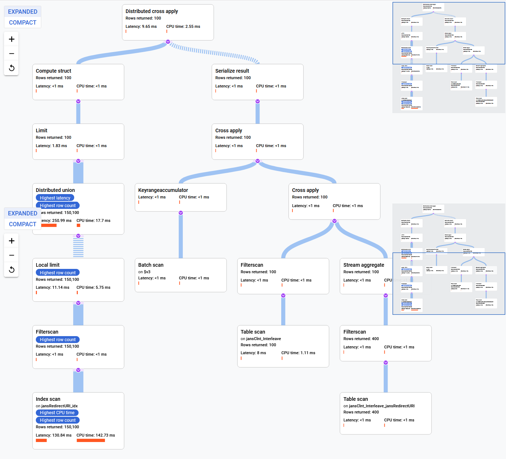

# Multi valued attributes storing mechanisms

Cloud Spanner DB supports ARRAY attributes but in same time it's not allows to index them. This led to full table scan when query has filter with these attributes. ALternative of this is to use interleave child tables support. These tables can increase queries performance but in parallel with this this approach requires additional storage space for child table and index. As result Spanner ORM should mix of both approaches.

## ARRAY attribute and interleave child table comparision

### DB structures and sample data

1. DB with ARRAY type

```
CREATE TABLE jansClnt_Array (
  doc_id STRING(64) NOT NULL,
  objectClass STRING(48),
  dn STRING(128),
  jansRedirectURI ARRAY<STRING(MAX)>,
) PRIMARY KEY(doc_id)

```

 <!-- .element height="50%" width="50%" -->

2. DB with child interleave table

```
CREATE TABLE jansClnt_Array (
  doc_id STRING(64) NOT NULL,
  objectClass STRING(48),
  dn STRING(128),
  jansRedirectURI ARRAY<STRING(MAX)>,
) PRIMARY KEY(doc_id)

```

 <!-- .element height="50%" width="50%" -->

### Java code which inserts 1M records into both DB structures
```
package io.jans.orm.cloud.spanner.operation.impl.test;

import java.util.Arrays;
import java.util.LinkedList;
import java.util.List;
import java.util.Properties;

import com.google.cloud.spanner.DatabaseClient;
import com.google.cloud.spanner.Mutation;
import com.google.cloud.spanner.Mutation.WriteBuilder;

import io.jans.orm.cloud.spanner.operation.SpannerOperationService;
import io.jans.orm.cloud.spanner.operation.impl.SpannerConnectionProvider;

public class SpannerMultiValuedDataPopulatorTest {

	public static void main(String[] args) {
		Properties props = new Properties();
		props.setProperty("connection.project", "projectId");
		props.setProperty("connection.instance", "insanceId");
		props.setProperty("connection.database", "db_name");
		props.setProperty("connection.client.create-max-wait-time-millis", "15");
		props.setProperty("connection.credentials-file", "path_to_creds_file");

		SpannerConnectionProvider connectionProvider = new SpannerConnectionProvider(props);
		connectionProvider.create();
		DatabaseClient client = connectionProvider.getClient();

		List<Mutation> mutations = new LinkedList<>();
		for (int i = 1; i <= 1000000; i++) {
			if (i % 50000 == 0) {
				System.out.println("Added: " + i);
			}

			String redirectURIs[] = new String[4];
			for (int j = 0; j < redirectURIs.length; j++) {
				redirectURIs[j] = String.valueOf(Math.round(Math.random() * 10));
			}

			if (i % 10000 == 0) {
				redirectURIs[3] = String.valueOf(Math.round(Math.random() * 2));
			}

			// Change to false to insert data into parent-child tables
			if (true) {
				WriteBuilder insertMutation = Mutation.newInsertOrUpdateBuilder("jansClnt_Array")
						.set(SpannerOperationService.DOC_ID).to(String.valueOf(i))
						.set(SpannerOperationService.OBJECT_CLASS).to("jansClnt").set("jansRedirectURI")
						.toStringArray(Arrays.asList(redirectURIs));

				mutations.add(insertMutation.build());
			} else {

				WriteBuilder insertMutation = Mutation.newInsertOrUpdateBuilder("jansClnt_Interleave")
						.set(SpannerOperationService.DOC_ID).to(String.valueOf(i))
						.set(SpannerOperationService.OBJECT_CLASS).to("jansClnt");

				mutations.add(insertMutation.build());

				for (int j = 0; j < redirectURIs.length; j++) {
					WriteBuilder insertDictMutation = Mutation
							.newInsertOrUpdateBuilder("jansClnt_Interleave_jansRedirectURI")
							.set(SpannerOperationService.DOC_ID).to(String.valueOf(i))
							.set(SpannerOperationService.DICT_DOC_ID).to(String.valueOf(j)).set("jansRedirectURI")
							.to(redirectURIs[j]);

					mutations.add(insertDictMutation.build());
				}
				client.write(mutations);
			}
			mutations.clear();
		}
		connectionProvider.destroy();
	}

}

```

### DB size comparision

 <!-- .element height="50%" width="50%" -->

### SQL statement examples

These queries returns ARRAY attributes and use it in filters

1. DB with ARRAY data type

```
SELECT
  doc.*
FROM
  jansClnt_Array doc
WHERE
  EXISTS (
  SELECT
    _jansRedirectURI
  FROM
    UNNEST(jansRedirectURI) _jansRedirectURI
  WHERE
    _jansRedirectURI = '10')
LIMIT 100
OFFSET 20000
```

 <!-- .element height="50%" width="50%" -->


2. DB with child interleave table

```
SELECT doc.*,
  ARRAY(
  SELECT
    c.jansRedirectURI
  FROM
    jansClnt_Interleave_jansRedirectURI c
  WHERE
    doc.doc_id = c.doc_id) jansRedirectURI_array
FROM
  jansClnt_Interleave doc
JOIN
  jansClnt_Interleave_jansRedirectURI c2
ON
  doc.doc_id = c2.doc_id
WHERE
  c2.jansRedirectURI = '10'
LIMIT 100
OFFSET 150000

```

 <!-- .element height="50%" width="50%" -->

### Stats after 4 executions

1. DB with ARRAY data type

 <!-- .element height="50%" width="50%" -->

2. DB with child interleave table

 <!-- .element height="50%" width="50%" -->

### Queries explanations

1. DB with ARRAY data type

 <!-- .element height="50%" width="50%" -->

2. DB with child interleave table

 <!-- .element height="50%" width="50%" -->


## Conclusions

Table size in DB with interleave child table is in 8.7 times bigger. This is major point when there are many records with multi valued attributes. From the other perspective statements execution with interleave child table is in 4 times faster. And the difference should be bigger after adding more records. These 2 point have simular weights. As result ORM should support both approaches. Fortunatelly Jans project in most cases doesn't use multi valued attributes in filters. We need to use interleave child tables only in few cases.

## Implementation notes

At startup ORM should scan DB metadata and use interleave tables if they are conform next naming pattern: `objectClass_attributeName`. Example: `jansClnt_jansRedirectURI`


